+++
title = 'ASCII、Unicode和UTF-8与字符编码'
date = 2024-01-02T14:38:04+08:00
draft = false
toc=true
featured_image = "images/image-20240103181022030.png"
omit_header_text = true

+++

# ASCII、Unicode和UTF-8与字符编码

在讨论这个问题之前先抛出一个问题：我们都知道计算机内部都是二进制，那么给定一些文本字符串比如英文单词Good, 我们是怎么知道要把它转化为**怎样的二进制的**？

<!--more-->

这个问题的答案是**字符编码**。

## 1.什么是字符编码

字符编码用来将人类可读的字符比如英文字母数字以及一些符号映射成一个数值，这个数值称为码位，然后通过一定规则用二进制来表示这个数值，它本质上是人为设计的一种规则或者理解为一种映射关系。理解什么是字符编码很重要，它有两个很重要的核心功能：

* 将字符根据规则映射成唯一数值并转化为对应的二进制
* 将二进制数据根据编码规则翻译成人类可读的字符

> 这也是计算机世界中的一种基本的思想方法论，类似的，音视频存储在计算机中也都有相应的音视频编码算法将其转化为二进制

## 2.有哪些字符编码

不同地区文化中的字符集(数量和种类差异), 他们通常有自己对应的字符编码标准，再加上一些厂商自定义的标准，以及技术迭代过程中的新需求，优化等原因导致字符编码有很多种，此处只列举一些常见的。

* ASCII: 最早的字符编码
* Unicode: 一个全球性的字符编码标准，为世界上**几乎**所有的字符提供了唯一的编号
* UTF-8: UTF-8是Unicode 的一种实现方式
* ISO-8859系列:
  * ISO-8859-1: 涵盖了西欧地区最常用的字符
  * ISO-8859-2: 设计用于中欧地区，涵盖了一些中欧国家的字符需求
  * ISO-8859-3: 主要设计用于支持南欧、南东欧和一些其他地区的语言
  * ...
* GBK: 主要用于简体中文
* Big5: 用于繁体中文
* ...

## 3.为什么有时候我们打开文件会看到乱码？

我们知道同一个字符在不同的字符编码下可能会被转化成不同的二进制，同一个二进制在不同字符编码下可能会被解释成不同的符号。当选用的这个字符编码中不包含该二进制对应的字符时我们就看到了乱码现象。因此当打开一个文本文件时，我们就必须知道它的编码方式。

## 4. ASCII（American Standard Code for Information Interchange）

[ASCII](https://zh.wikipedia.org/wiki/ASCII)是一种最早的字符编码标准，它于20世纪60年代初由美国发布，规定了英语和二进制位之间的关系。它规定了128种字符，具体有哪128种可查询对应的表格资料，比如字母A对应的二进制是0100 0001。

但是很明显，区区只有128种对于其他语言的字符则不足够，比如光常用汉字就有几千个，那我们怎么处理汉字呢？

聪明的同学可能想到了上面提到的GBK和Big5是用来处理简繁体中文的，那么假如一段文本中既包含中文又包含一些特殊的拉丁字母呢？此时应该用什么字符编码来存储和打开这个文本文件呢？

面对多元的文化环境，如果能有一种字符编码能包含世界上所有的字符是不是会更加方便。于是，Unicode应运而生。

## 5. Unicode

Unicode旨在涵盖全球范围内的所有语言和字符。它规定了每一个字符所对应的数字，比如中文“嗨” 对应的二进制是101010111101000，但是unicode 却并没有规定怎么存储，假如我们直接高位补0把101010111101000存到计算机中，那读取的时候怎么解释呢？计算机怎么知道这16位二进制(2字节）是表示一个字符还是两个字符？

那为什么unicode 不规定就2个字节表示一个字符呢 因为在unicode中一个字符可能需要占用1～n字节不等，为了适配所有字符，就必须规定n(n>1)字节表示一个字符，那对于那些明明一个字节就可以表示的字符，却非要用n字节来表示，造成了空间的浪费。

**重点**：Unicode 只规定了字符和数字的映射关系，但却没有规定这些数字怎么存储，当我们把某个字符对应的数字理解为这个字符对应的unicode时，unicode 并没有告诉我们这个unicode 该如何存储到计算机中。

## 6.UTF-8（Unicode Transformation Format）

由于Unicode 没有规定存储方式，导致unicode 有多种实现方式, 其中UTF-8是其中一种最常见的实现方式。

UTF-8是一种针对Unicode设计的可变长度字符编码方案。对于常用的英文字母和符号，其编码与ASCII兼容，它使用8位二进制数（1字节）来表示。但对于那些不属于ASCII字符集的Unicode字符，UTF-8采用了不同的编码方式。

其编码规则：

1）对于单字节的符号，字节的第一位设为`0`，后面7位为这个符号的 Unicode 码。因此对于英语字母，UTF-8 编码和 ASCII 码是相同的。

2）对于`n`字节的符号（`n > 1`），第一个字节的前`n`位都设为`1`，第`n + 1`位设为`0`，后面字节的前两位一律设为`10`。剩下的没有提及的二进制位，从低位开始逐渐补全为这个符号的 Unicode 码，高位不足的补0。

| 字符 | Unicode | unicode 二进制    | UTF-8编码方式                                       | 说明                                |
| ---- | ------- | ----------------- | --------------------------------------------------- | ----------------------------------- |
| A    | U+0041  | 01000001          | **0**1000001                                        | 对于单字节的符号，字节的第一位设为0 |
| é    | U+00E9  | 11101001          | **110**00011 **10**101001                           | n=2                                 |
| 中   | U+4e2d  | 100111000101101   | **1110**0100 **10**111000 **10**101101              | n=3                                 |
| 😄    | U+1F601 | 11111011000000100 | **11110**000 **10**011111 **10**011000 **10**000001 | n=4                                 |

你没看错，unicode 也可以表示表情包符号。对于更详细的UTF-8编码规则可参阅相关文档。

## 总结

1. 字符编码用来规定字符和数值(码位）之间，以及码位和计算机二进制之间的一一对应关系，不同的字符编码这个映射关系不同
2. ASCII是一种最早的字符编码标准用来处理英文及常见标点等128种字符，而Unicode 包含更多的字符集，旨在为世界上几乎所有的字符提供一个唯一的数值标识，以便在不同的计算机系统和应用程序中进行一致的文本处理，因此ASCII字符集是Unicode字符集的一个子集。
3. Unicode 并不规定码位的存储方式，它的存储和表现方式取决于具体的编码方案，其中最常见的是UTF-8, 此外还有UTF-16, UTF-32等。UTF-8是unicode 的一种具体实现。
