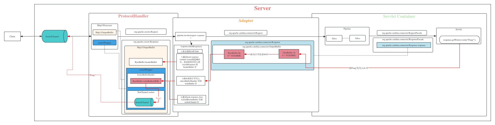
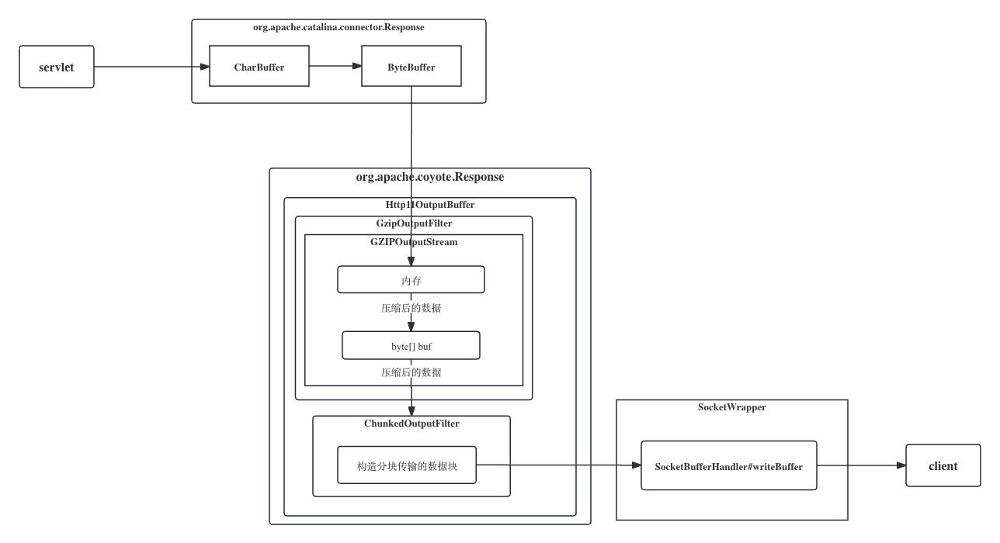

+++
title = 'tomcat chunk response and compresssion'
date = 2024-02-29T13:38:34+08:00
draft = true
image = "images/IMG_0942.png"
categories = [
    "tomcat",
    "http"
]

+++


# HTTP压缩

http压缩通常是指服务器对即将要发送给客户端的响应进行压缩，再由客户端进行解压缩，以此达到减少传输的数据量，提升接口或页面性能的目的。

**常见的压缩算法**

* deflate: 基于deflate算法
* gzip: GNU zip格式, 目前使用最为广泛
* br:  一种新的开源压缩算法，专为HTTP内容的编码而设计
* ...

由此就产生一个问题，服务器怎么知道应该用哪种压缩算法进行压缩？

# 客户端和服务端就压缩方案进行协商

压缩方案协商为两步：

1. 客户端在发起请求的时候用`Accept-Encoding` 这个header来告诉服务端自己支持哪些算法，例如：

   ```xml
   Accept-Encoding: gzip, deflate, br
   ```

2. 服务端会从客户端支持的算法中选择一个或多个对响应体进行压缩，然后通过`Content-Encoding` 来告诉客户端自己用了哪种算法来压缩，以便客户端再用对应的算法来解压缩，例如：

   ```xml
   Content-Encoding: gzip
   ```

## FAQ

1. **如果客户端支持的压缩算法但服务端都不支持那怎么办？**

   那就不压缩，爱咋咋。这时候在响应头里就没有显示的`Content-Encoding`这个header了，或者说会采用它的默认值**identity**, 表明没有对响应体进行压缩。

2. **常看到响应头里有`Vary:Accept-Encoding`, 这是什么？**

   Vary 首部字段常常在进行主动协商的响应中发送，用于指示选择算法中使用了请求信息的哪些部分。在 HTTP 中，主动协商是指服务器根据客户端的能力和偏好，以及资源的特性，选择最合适的响应进行发送。

   简而言之，当服务器基于客户端请求的一些特定信息（比如 Accept-Encoding）来选择合适的响应时，它可以通过 Vary 首部字段来明确说明使用了哪些请求信息。这对于缓存和代理服务器来说尤为重要，因为它们可以根据 Vary 字段中列出的请求头部信息来判断是否可以使用缓存的响应，或者是否需要重新向源服务器请求新的响应。更多详细信息可以参考[RFC 7231 section 7.1.4](https://datatracker.ietf.org/doc/html/rfc7231#section-7.1.4)

3. **类似的还看到`Transfer-Encoding`, 这个又是什么？**

   `Content-Encoding` 用于描述消息体的压缩方式，而 `Transfer-Encoding` 则用于指示消息传输时的编码方式，比如`Transfer-Encoding:chunked`表明将消息进行分块传输。比如`Transfer-Encoding:identity`表明消息体的长度已知且未进行编码

4. **等等，分块传输是什么以及为什么要有分块传输？**

# 分块传输

分块传输顾名思义就是将响应消息体分多次发送，一次发送一部分数据。我们先来了解一下与之对应的“**一次性传输**”，也就是一次性发送所有数据。

HTTP协议是应用层协议，客户端和服务端进行交互是建立在TCP链接之上，现在假设服务端要向客户端传送数据，在传送完一段数据后下一步客户端该干嘛呢？

站在客户端视角的第一个疑问就是：**这个数据传送完了吗？**

所以为了让客户端知道数据是否传送完毕，一种方案就是服务端在传送响应体之前计算消息的长度，然后把这个长度通过`Content-Length` 这个响应头告诉客户端，在客户端收到一部分数据后它可以计算收到的数据长度，如果和Conent-Length的值一样，那就可以认为数据传送完了然后客户端下一步就可以做自己想做的事(比如关闭TCP链接，或者发起一个新的请求)。 这就是一次性传输及`Content-Length` 在这个过程中发挥的作用。另一种方案是服务端在发送完数据就关闭TCP链接，这样客户端看到服务端关闭了链接，也可以约定只要你关闭链接我就认为数据传输完了，但是基本上不会这么做。

> **如果Content-Length 和真实长度不一致会怎样？**
>
> 如果Content-Length小于真实长度，则客户端会对内容进行裁剪，对外表现就是数据不完整。
>
> 如果Content-Length小于真实长度，则客户端请求会一直pengding, 因为它认为响应还没有结束。

在第一种方案中需要提前计算消息长度，对于普通的较小的文本还好说，但如果消息很长，很大，比如一些文件，这个计算过程很费时间或者空间，在客户端看来这个请求的响应就很慢。所以就有了分块传输的做法，不计算长度，把数据分成不同的小块逐步发送。

例如：

```kotlin
socket.getOutputStream().write("HTTP/1.1 200 OK\r\n".toByteArray())
socket.getOutputStream().write("Transfer-Encoding: chunked\r\n".toByteArray())
socket.getOutputStream().write("Content-Type: text/plain\r\n".toByteArray())
socket.getOutputStream().write("\r\n".toByteArray())
socket.getOutputStream().write("5\r\n".toByteArray())
socket.getOutputStream().write("123\r\n\r\n".toByteArray())
socket.getOutputStream().flush()
socket.getOutputStream().write("2\r\n".toByteArray())
socket.getOutputStream().write("ab\r\n".toByteArray())
socket.getOutputStream().flush()
socket.getOutputStream().write("0\r\n".toByteArray())
socket.getOutputStream().write("\r\n".toByteArray())
socket.getOutputStream().write("13\r\n".toByteArray())
socket.getOutputStream().write("am I ignored?\r\n".toByteArray())
socket.getOutputStream().flush()分块传输方法：
```

* 需要在响应头中添加：Transfer-Encoding: chunked 
* 响应头结束需要添加CRLF(\r\n)表示响应体的开始
* 每一个响应块第一行表示该块的长度(结尾是CRLF)，然后是数据本身，遇到CRLF,表明块结束，若第一行长度和真实数据长度不一致通常客户端会解析失败
* 最后一个块必须长度为0，不包含任何数据并依旧以CRLF结尾。

# Tomcat 中的分块传输与响应压缩

tomcat HTTP压缩功能手动开启方式如下：在`server.xml`中

```xml
<Connector port="8080" protocol="HTTP/1.1"
     connectionTimeout="20000"
     compression="on" <!-- 开启压缩 -->
     compressionMinSize="10" <!-- 压缩阀值, 当消息长度超过的时候才进行压缩 -->
     <!-- 压缩类型 -->
     compressableMimeType="text/html,text/xml,text/javascript,application/javascript,text/css,text/plain,text/json"
     redirectPort="8443"/>
```

更多详细配置方式可参考[Apache Tomcat 10 Configuration Reference](https://tomcat.apache.org/tomcat-10.1-doc/config/http.html)

> 压缩就会更好吗？不是，压缩意味着服务端更多的资源消耗

**用来测试的Servlet**

```kotlin
class TestCompressionServlet : HttpServlet() {
    override fun doGet(request: HttpServletRequest, response: HttpServletResponse) {
        val stringBuilder = StringBuilder()
        for (i in 1 until 10000000) {
            stringBuilder.append("Hi,")
        }
        response.writer.write(stringBuilder.toString())
    }
}
```

这里会向客户端返回一个很长的字符串，在[《Tomcat架构原理解析》](https://woaihuangfan.github.io/posts/tomcat%E6%9E%B6%E6%9E%84%E5%8E%9F%E7%90%86%E8%A7%A3%E6%9E%90/#%E5%93%8D%E5%BA%94%E8%BF%87%E7%A8%8B) 中我们说到servelt 通过`response.writer.write` 写入响应的时候其实是先写入org.apache.catalina.connector.Response内部维护的CharBuffer中，最后会把CharBuffer转为ByteBuffer中然后交给SocketHandler的writeBuffer最后才会写入socket中。



我们现在要写入的是一个很长的字符串，而Buffer却只有8KB, 怎么办？Tomcat 是这么处理的：

1. 在写入CharBuffer 后，如果CharBuffer满了会将CharBuffer 中的数据flush 到ByteBuffer, 然后清空CharBuffer，源码位置：`org.apache.catalina.connector.OutputBuffer#write`

2. 剩下的数据继续写入CharBuffer, 重复1的步骤
3. 如果在#1中，ByteBuffer也满了，会flush 数据到`org.apache.coyote.Response`中并清空ByteBuffer，调用它的write方法， 最终会调用到`Http11OutputBuffer`的doWrite方法。源码位置：`org.apache.coyote.http11.Http11OutputBuffer#doWrite`
   * 这时候Http11OutputBuffer如果发现Response 还没commit, 会通过action调用`Http11Processor` 来commit response，这一步会准备响应的响应行(包括协议和状态码，例如：HTTP/1.1 200）以及响应头, 然后将这部分信息写到Http11OutputBuffer的headerBuffer中，
   * headerBuffer的大小可进行配置，若超出大小则抛BufferOverflowException。
   * 然后通过outputBuffer.commit()将这部分数据存到socketBufferHandler的writeBuffer中，如果writeBuffer也满了则会写到socket中。
4. 在3#中准备响应头的时候(源码位置：`org.apache.coyote.http11.Http11Processor#prepareResponse`)，如果开启了压缩功能：
   * 添加`Vary: accept-encoding` header。
   * 根据Request中accept-encoding这个header传过来的值判断客户端是否支持`gzip`，若支持则设置contentLength为-1， 若不支持那就不压缩。也就是说tomcat 默认只支持gzip压缩
   * 如果contentLength不为-1，则添加`ChunkedOutputFilter`为activeFilters
   * 如果发现支持gzip, 则会添加`GzipOutputFilter`为activeFilters

5. 然后继续回到3#中Http11OutputBuffer的doWrite 方法，在commit response 之后会调用GzipOutputFilter的doWrite方法，然后调用GZIPOutputStream的doWrite方法，GZIPOutputStream会将消息先读取到内存中。源码位置：`org.apache.coyote.http11.filters.GzipOutputFilter#doWrite` 及`java.util.zip.Deflater#deflate(byte[], int, int, int)`
6. 继续1#，2#，5#，直到所有的响应体数据全部读取到内存中。
7. 经过前面几步后这个长响应体大部分都已经被传输到客户端，还有一小部分可能存在CharBuffer和ByteBuffer中，servlet 的service 方法也会执行结束，来到Adapter的`response.finishResponse()` 阶段，源码位置：`org.apache.catalina.connector.Response#finishResponse`
   * 如果CharBuffer中有数据则flush到ByteBuffer，如果ByteBuffer满了则继续3#，5#。
   * 调用doFlush方法，再次flush CharBuffer 和flush ByteBuffer
   * 通过Close Action调用Http11Processor的finishResponse方法，然后调用到GzipOutputFilter的end方法，标记flush为true
   *  然后调用native 方法进行gzip 压缩，每次压缩的数据长度为GZIPOutputStream内部的byte数组buf长度（默认512), 压缩完后并存储在buf中
     * 如果buf满载的情况下，块中第一行标明数据长度会是512，用十六进制200表示。源码位置：
   * 每次压缩完后将压缩后byte传给ChunkedOutputFilter，调用ChunkedOutputFilter的doWrite方法。ChunkedOutputFilter会构造需要分开传输的块，然后将块写入到socketBufferHandler的writeBuffer中。如果writeBuffer也满了则会写到socket中，开始分块传输。
   * 继续压缩剩余数据，直到内存中所有响应数据压缩完成，标记finished 为true
   * 按照GZIP 算法要求构造数据尾部，并继续传递给ChunkedOutputFilter，至此全部的压缩数据都已处理完成




