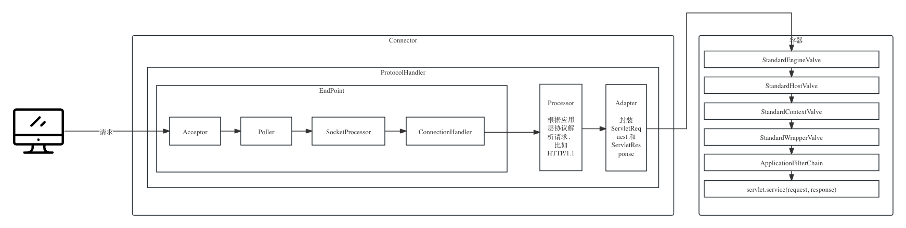

+++
date = '2024-01-10T11:28:33+08:00'
draft = false
title = 'tomcat架构原理解析'
toc = true
featured_image = "images/IMG_1890.png"
omit_header_text = true
image = "images/IMG_1890.png"
categories = [
    "tomcat",
]
+++


Tomcat自1998年问世以来因为其高性能，免费等特点广受Java爱好者的喜爱，但在Springboot等微服务框架成为技术主流后的今天，tomcat似乎逐渐"消失"在大众的视线中，你还在用tomcat吗？我相信对于大部分java web developer来说这个问题的答案是Yes, 因为Springboot web starter默认集成的就是tomcat。

本文尝试从"为什么浏览器发出的HTTP请求可以到达我们的Controller"这一基本问题出发，由浅入深，由点到面的方式先从整体的角度来梳理tomcat的架构原理，再到以一个HTTP/1.1 请求为例来分析tomcat作为一个HTTP web服务器和Servlet容器它是怎么实现的，最后回归这个问题梳理springboot是如何与tomcat集成的。其中涉及大量的源码解析，请留意涉及源码解析的部分都是基于**tomcat 10.x** 来进行。希望能给那些对tomcat原理感兴趣的同学提供一些视角和参考。

<!--more-->

# 什么是Tomcat

## Tomcat的核心功能

**tomcat是一个==web应用服务器==和==Servlet容器==，它还是 Jakarta Servlet、Jakarta Server Pages、Jakarta Expression Language、Jakarta WebSocket、Jakarta Annotations 和 Jakarta Authentication 规范的开源实现**。

这里有两个重点，web应用服务器和Servlet容器。分别对应了它的两个核心功能：

> 什么是Web服务器, 说白了，它的作用就是将主机上的某个资源映射成一个URL供外界访问。

- 处理 `Socket` 连接，负责网络字节流与 `Request` 和 `Response` 对象的转化。
- 加载并管理 `Servlet` ，并将请求交给Servlet处理。

但`web服务器` 和`servlet容器`依旧显的有些抽象，他们到底是什么？


理解什么是tomcat 就是理解tomcat到底帮我们做了什么。我们在上手做Java web项目时往往都是基于框架比如springboot,来专注于业务代码开发，我们知道按照springboot 的规则来定义一些controller, 就可以接收到从浏览器发过来的HTTP请求。

但是，==**为什么controller可以收到并处理客户端发过来的请求**==?

答案是因为gradle 或者maven 中有`spring-boot-starter-web` 这个依赖，而这个依赖默认帮我们集成了Tomcat。在进一步理解tomcat是怎么帮我接收并解析HTTP请求之前，我们先设想，如果没有框架，站在tomcat开发者的角度来思考我们要自己实现下面这样的功能应该要怎么做。

```gherkin
Scenario: Receive and Process HTTP Request

Given the system is running
When a valid HTTP request is received
Then the system should successfully parse the HTTP request
And extract the request path, parameters, method, and body if present
And generate an appropriate HTTP response
And include the correct HTTP status code indicating successful processing
And include the expected response body format and data if applicable
And include the appropriate HTTP headers in the response (e.g., Content-Type)
```


## 理解HTTP 请求的本质

HTTP请求是客户端在向服务端请求某个资源时，向服务端发送的是符合HTTP协议规范的数据，下面给出一个完整的GET 请求示例

```http
GET /sample HTTP/1.1 
Host: www.example.com
Accept: application/json
```

## 手写最简版**Tomcat**

### 如何发起HTTP请求？

发起HTTP请求其实就意味着我们要把这部分数据发送给服务端。

那我们要怎么把这部分数据发送给服务器呢？这其实涉及计算机网络的基础，计算机之间是如何通信的。

假设有一个主机A，有一个主机B，A需要通过浏览器发送HTTP请求给B的Java 进程。那么经历如下步骤：

1.**HTTP 是应用层协议，在发送数据之前，A中的浏览器需要和B中的Java 进程建立一个TCP 链接。**

那我们如何建立TCP 链接呢，其实这部分工作是由应用层的底层库去帮我们来做的。以Java 为例，这个类库就叫做Socket。它也是在网络通信中的一个种抽象概念，从Java的角度来理解建立一个TCP 链接其实就是生成了一个Socket 对象，下面是一个建立TCP链接示例：

```kotlin
 val socket = Socket("google.com", 443)
 println(socket.isConnected)
```

当上述代码输出`true` 就表明已经建立了链接，这底层由JDK 调用操作系统API 来实现。

2.**链接建立后，我们就可以流式的传输数据，发起HTTP请求其实就是向一个地方去写符合HTTP规范数据**。

向哪里写？依旧以Java 为例，上面说到在网络中的通信我们有个抽象的东西叫Socket, 而JDK 类库帮我们做了底层实现，因此我们写数据读数据还是面向Socket。下面是向socket 数据的示例：

```kotlin
# 写入一个字节数组
socket.getOutputStream().write("Ping!".toByteArray())
#也可以写入单个字节
socket.getOutputStream().write(71)
```

> 这里的byte,71根据字符编码可以解析成对应的字符，71通常对应的是字母G,  关于字符编码请参考我的另一篇笔记：[ASCII、Unicode和UTF-8与字符编码](https://woaihuangfan.github.io/posts/ascii-unicode-and-charset/)

3.**我们向Socket写入数据后，剩下的也会由jvm和操作系统帮我们处理，通过通信网络传输到主机B上**。

至此，我们已经知道了客户端发起一个HTTP请求的时候干了什么，不同的应用程序底层对于Socket可能有不同实现, 但这部分底层细节其实往往不用我们操心，我们只需要知道发起HTTP请求就是发送了一段符合HTTP协议规范的数据到服务端。关于更多HTTP 协议的内容请参阅相关文档。

### 如何接收并处理HTTP 请求? 

#### 端口监听

上面说到发起HTTP 请求其实就是发送一段数据给服务端，那为什么可以发送数据呢？因为我们在发送数据之前建立了TCP 链接，而TCP 是一种面向链接的可靠的协议，那为什么可以建立TCP链接？`Socket("google.com", 443)` 这段代码中的两个参数是什么含义？

域名会被DNS服务器解析成ip, 用来在网络传输中找到对应的主机，而443则表示服务器正在监听的端口， 注意一个进程可能会用到多个端口。

下面我们看怎么在Java 中开启这样的端口监听。

```kotlin
val serverSocket = ServerSocket(8080)
 println("Server started successfully, listening on port: 8080")
```

我们用到了`ServerSocket`这个类，它提供了一种机制，使得Java应用程序能够监听客户端的连接请求，并在连接建立后进行通信。而这底层也是有JDK调用操作系统API 实现。

1.它建立了一个专门侦听某端口的socket

2.每次成功与客户端握手后,会创建一个针对当前客户的新socket

3.后续程序通过这个socket与客户端进行数据交互

#### 读取数据并解析成HTTP 请求

再次说到发起一个HTTP请求就是发送了一段数据给服务器，我们看怎么样读取这份数据。

```kotlin
# 建立ServerSocket后调用accept 方法来接收请求，在有请求到来之前这个方法会一直阻塞，并且为了处理多次请求，一般会循环调用
val socket = serverSocket.accept()
# 上述方法返回了Socket, 这和我们从客户端建立链接时看到的Socket 是一样的，因为说了，网络上的通信我们都是面向Socket
val bytes = socket.getInputStream().let {
    val bytes = ByteArray(it.available())
    it.read(bytes)
    bytes
}
println(bytes.decodeToString())
```

在10行运行完后我们可以在控制台看到类似下面这样的输出：

```http
GET /sample HTTP/1.1 
Host: www.example.com
Accept: application/json
```

这正是我们在客户端发起的HTTP 请求！

然后我们就可以去解析这段文本，包括去解析请求行，请求头，请求体等基于字符串操作去进行具体的业务处理。

#### 如何响应

响应是由服务端向客户端响应，响应就是回传满足HTTP 协议的规范数据，同样是面对socket 对象进行，JDK 和操作系统会帮我们处理底层和剩下的事。

```kotlin
socket.getOutputStream().write(
    ("HTTP/1.1 200 OK\r\n" +
            "Content-Type: text/plain\r\n" +
            "Content-Length: 25\r\n" +
            "\r\n" +
            "Hello, World and /sample!"
            ).toByteArray()
)
```

客户端接收到这份数据后便可以根据根据HTTP 协议解析数据然后作对应处理。

以上就是自己去实现这个需求要做的事，然而我们平时在使用springboot开发时几乎不需要关心这些，因为集成的tomcat会帮我们处理，这正是Tomcat 的核心功能之一：

==**处理 `Socket` 连接，负责网络字节流与 `Request` 和 `Response` 对象的转化**==。

#### 最简版**Tomcat**

将以上步骤再串起来我们就可以自己去实现tomcat， 注意，真正的tomcat实现和功能要比这个复杂的多，但理解这部分内容对于我们理解什么是Tomcat很重要，因为**tomcat在坐着类似的事情**。

**测试先行**

```kotlin
@Test
fun `should successfully process valid HTTP request`() {
    // Given
    MyHttpServer(TEST_PORT).start()

    // When
    // 发起HTTP 请求
    val socket = sendRequest()

    // Then
    assertEquals(
        "HTTP/1.1 200 OK\r\nContent-Type: text/plain\r\n" + "Content-Length: 25\r\n\r\nHello, World and /sample!",
        decodeResponse(socket)
    )

}

/**
 * 1.建立socket连接
 * 2.向socket中写入符合HTTP规范的数据
 * 3.返回socket
 */
private fun sendRequest(
    httpRequest: String = "GET /sample HTTP/1.1\r\n" + "Host: localhost\r\n" + "Accept: application/json\r\n\r\n"
): Socket {
    val socket = Socket(Constants.LOCAL_HOST, Constants.TEST_PORT)
    socket.getOutputStream().write(httpRequest.toByteArray(Charset.defaultCharset()))
    return socket
}
```

**SampleHttpServer类** 

* 负责创建ServerSocket监听端口
* 接收客户端的请求，从Socket 中读取数据解析成Request对象
* 构建Response 对象并向Socket中写入数据

```kotlin 
package com.fan

import java.net.ServerSocket
import java.net.Socket
import java.net.SocketException
import java.nio.charset.StandardCharsets


class SampleHttpServer(private val port: Int) {

    private lateinit var serverSocket: ServerSocket

    private var isRunning = true

    fun start() {
        createServerSocket(port)
        println("${currentThreadName()}Server started successfully, listening on port $port")
        Thread {
            while (isRunning) {
                val clientSocket = acceptClientConnection(serverSocket)
                clientSocket?.let {
                    try {
                        handleClientRequest(clientSocket)
                    } catch (e: Exception) {
                        e.printStackTrace()
                    } finally {
                        closeSocket(clientSocket)
                    }
                }
            }
        }.start()
    }

    private fun closeSocket(clientSocket: Socket) {
        checkIfSocketClosed(clientSocket)
        if (!clientSocket.isClosed) {
            clientSocket.close()
            checkIfSocketClosed(clientSocket)
        }
    }

    private fun checkIfSocketClosed(clientSocket: Socket) {
        println("${currentThreadName()}client socket closed? ${clientSocket.isClosed}")
    }

    private fun createServerSocket(port: Int) {
        this.serverSocket = ServerSocket(port)
    }

    private fun acceptClientConnection(serverSocket: ServerSocket): Socket? {
        try {
            val clientSocket = serverSocket.accept()
            println("${currentThreadName()}Accepted client connection from: ${clientSocket.inetAddress}")
            return clientSocket
        } catch (e: SocketException) {
            //socket maybe closed from client, ignore
            println("${currentThreadName()} ${e.message}")
        }
        return null
    }

    private fun handleClientRequest(clientSocket: Socket) {
        val requestBytes = readBytesFromSocketInputStream(clientSocket)
        println("${currentThreadName()}Received bytes from client:${requestBytes.contentToString()}")
        val httpRequest = parseBytesToHttpRequest(requestBytes)
        val httpResponse = buildResponse(httpRequest)
        sendResponseToClient(httpResponse, clientSocket)
    }

    private fun readBytesFromSocketInputStream(socket: Socket): ByteArray {
        return socket.getInputStream().let {
            val bytes = ByteArray(it.available())
            it.read(bytes)
            bytes
        }
    }

    private fun parseBytesToHttpRequest(bytes: ByteArray): Request {
        val plainRequest = String(bytes, StandardCharsets.UTF_8)
        println("${currentThreadName()}Received request:\r\n--------------\r\n$plainRequest\r\n--------------")
        val httpMethod = extractHttpMethod(plainRequest)
        val uri = extractUri(plainRequest)
        val protocol = extractProtocol(plainRequest)
        return Request(httpMethod, protocol, uri)
    }


    private fun extractHttpMethod(plainRequest: String): String {
        return plainRequest.substring(0, plainRequest.indexOf(" "))
    }

    private fun extractUri(plainRequest: String): String {
        val start = plainRequest.indexOf(" ") + 1
        val end = plainRequest.indexOf("HTTP") - 1
        return plainRequest.substring(start, end)
    }

    private fun extractProtocol(plainRequest: String): String {
        val start = plainRequest.indexOf("HTTP") + 5
        val end = plainRequest.indexOf("\r\n")
        return plainRequest.substring(start, end)
    }

    private fun buildResponse(request: Request): Response {
        val body = "Hello, World and ${request.uri}!"
        return Response(
            statusLine = "HTTP/1.1 200 OK",
            headers = "Content-Type: text/plain\r\nContent-Length: ${body.length}",
            body = body
        )
    }


    private fun sendResponseToClient(response: Response, socket: Socket) {
        val responseBytes = response.toString().toByteArray()
        socket.getOutputStream().write(responseBytes)
        println("${currentThreadName()}Response sent to client.")
    }

    private fun currentThreadName() = "[${Thread.currentThread().name}] "

    fun stop() {
        isRunning = false
        if (::serverSocket.isInitialized) {
            serverSocket.close()
        }
    }
}

```

**Request 和 Response**

```kotlin
package com.fan

data class Request(
    val method: String,
    val protocol: String,
    val uri: String
)

data class Response(
    val statusLine: String,
    val headers: String,
    val body: String
) {
    override fun toString(): String {
        return statusLine + "\r\n" + headers + "\r\n\r\n" + body
    }
}
```

> 源码地址: https://github.com/woaihuangfan/how-tomcat-works.git

这是采用大部分人较为熟悉BIO的的实现方式，而从tomcat 8.0开始会默认使用NIO的方式来处理请求，关于NIO的demo请在源码中寻找`NioHttpServer`。


## 什么是Servlet 

web开发，我们其实主要处理三件事：

1. 接收请求： 从socket 中读取数据
2. 处理请求：具体的业务逻辑，比如针对数据库的curd
3. 响应: 向socket 中写入数据

#1和#3操作是基础操作，大家都要干这事且干的方式基本都一样，无非就是针对socket的网络编程，但是处理请求的部分是不同的，因为业务逻辑千差万别万别。

#1中读取到数据后，需要交给一个东西(对象)让2#来处理请求，这个东西处理完请求后还要生成响应交给#3， 我们把这个东西(对象) 叫**Servlet**。Servlet 就是#1 和#2， #2和#3之间的这个中间层。

> 一个有意思的问题是，处理请求时只能用一个对象吗？当然不是，我们处理请求可能需要用到多个对象（比如controller，service),  但这些controller service 对象能叫servlet吗？。

所以这三件事再具体一点总结下就是：

1. 接收请求： 从socket 中读取数据， ==并把数据交给Servlet==
2. 处理请求：Servlet处理具体的业务逻辑，比如针对数据库的curd，然后生成响应
3. 响应: 获取Servlet生成的响应并向socket 中写入数据

1和3的操作大家可以共用，因此可以放到框架里，#2需要我们自己去实现，现在问题来了，我们知道要写Servlet 去处理请求，但是我怎么知道该怎么写？比如需用什么方法命名，参数等等才能被框架调用到。

有同学可能说取决于你用什么框架， 但如果想换框架怎么办？

因此我们就有了**Servlet规范**，来指导框架怎么写，servlet怎么写，以确保不同的Servlet容器（例如Tomcat、Jetty等）之间的兼容性。比如:

1. 规定了所有Servlet类都必须实现`javax.servlet.Servlet ` 这个接口

2. 定义了Servlet的生命周期，比如规定每一个servlet 都必须有 `init()`、`service()`、`destroy()`，

3. 描述了Servlet容器的职责和功能，比如当请求来了会调用Servlet实例的service方法

4. 等等。更多详细的规范请参阅

   

> ⚠️ Servlet API 的包名自2020年12月Jakarta EE 9 发布后已经从 `javax.servlet` 更改为 `jakarta.servlet`

相信很多人在学java web 时一开始都会去学怎么写一个Servlet.

> 规范、约定的思想随处可见，这个世界万物的运行本质上也是基于规范规则。

再去理解什么是tomcat的时候发现**tomcat 其实也实现了Servlet规范**， 也可以理解为什么说**Tomcat 是servlet 容器**了。

**小结**

* Servlet 是一段程序
* 需要符合Servlet规范
* 它主要用于处理和响应HTTP 请求
*  运行在支持Servlet规范的容器中


# Tomcat 的工作原理

虽然应用大部分应用都是基于springboot及其默认内嵌的tomcat进行开发，但是脱离复杂的spring把tomcat作为独立部署的中间件可以更好的来帮助我们来学习和了解tomcat。

1. **下载Tomcat**

```bash
curl https://dlcdn.apache.org/tomcat/tomcat-10/v10.1.18/bin/apache-tomcat-10.1.18.zip -o apache-tomcat-10.1.18.zip
```

解压后可以看到如下目录结构：


2. **自定义一个Servlet**

   以下代码由kotlin 实现，注意`HttpServlet` 已经实现了`jakarta.servlet` 所以此处我们只需要继承HttpServlet就行。

   ```kotlin
   class DemoServlet : HttpServlet() {
       override fun doGet(request: HttpServletRequest, response: HttpServletResponse) {
           response.writer.write("Pong!")
       }
   }
   ```

3. **编译上述代码，得到class文件**

   由于是kotlin 代码，所以我们可以用IDEA 进行编译，也可以用离线的kotlin编译器，我是选择的前者。

   

4. **将class 文件拷贝到tomcat指定目录**

   * 在`webapp` 下创建一个目录命名为my-app， 并在my-app创建如下目录结构：

     ```
     my-app
     └── WEB-INF
         ├── classes
         │   └── org
         │       └── fan
         │           └── DemoServlet.class
         ├── lib
         │   ├── annotations-13.0.jar
         │   └── kotlin-stdlib-1.9.21.jar
         └── web.xml
     ```

   

   * `web.xml` 的内容如下

     ```xml
     <?xml version="1.0" encoding="UTF-8"?>
     <web-app xmlns="http://xmlns.jcp.org/xml/ns/javaee"
              xmlns:xsi="http://www.w3.org/2001/XMLSchema-instance"
              xsi:schemaLocation="http://xmlns.jcp.org/xml/ns/javaee http://xmlns.jcp.org/xml/ns/javaee/web-app_3_1.xsd"
              version="3.1">
     
         <servlet>
             <servlet-name>DemoServlet</servlet-name>
             <servlet-class>com.fan.DemoServlet</servlet-class>
         </servlet>
     
         <servlet-mapping>
             <servlet-name>DemoServlet</servlet-name>
             <url-pattern>/ping</url-pattern>
         </servlet-mapping>
     
     </web-app>
     
     ```

     这一步就是配置映射规则，让符合规则的请求被指定的servlet处理。

5. **通过bin目录下的脚本启动Tomcat**

   ```bash
   chmod -R +x ./bin
   ./bin/startup.sh
   ```

6. **浏览器访问http://localhost:8080/my-app/ping**


可以看到我们只要把自己写的Servlet 按照tomcat 的规则放到指定目录下，然后运行tomcat 我们写的Servlet就可以处理请求，下面解释下我刚刚创建的目录结构的作用。

* `classes` 这个目录存放我们自己写的Servlet编译后的字节码文件

  > 什么是字节码文件？里面存的是什么？长什么样子？

* `lib` 存放我们需要用到的依赖，因为我是用kotlin编写的，所以需要用到相关依赖

* `web.xml` 存放Tomcat相关配置，上面我们只告诉了tomcat 把URI为`/ping` 的请求交给 DemoServlet处理

至此我们可以看到tomcat 至少做了如下的事：

* 监听网络端口
* 接受网络请求
* 读取网络数据
* 根据HTTP 协议解析数据
* 加载class 文件及jar 文件
* 调用DemoServlet的doGet 方法
* 将响应的字节流写回给浏览器

要做这些事肯定不会像我们demo版代码中那么简单，肯定经过设计的，但是无论怎么设计，每个接口和模块都有它自己的职责和要处理的事情，下面先看看tomcat 的整体架构。

## Tomcat架构

Tomcat整体架构是一种分层的结构，我们先看一个结论图(来源于网络)， 后面我在分析源码的时候会逐渐把源码和这个图对应起来。


在这小节我们可以先只关注`Server`、 `Service`、`Connector`、`Engine`、`Host`、`Context`、`Wrapper`， 记住这几个组件名字及他们的层级关系,  其中除Connector没有抽象出接口外，其余也都对应了tomcat中几个顶级接口名字(例如`org.apache.catalina.Server`), 而`StandardXXX` 是这些接口的实现。

注意：**下文贴出的源代码部分都是精简过后的关键代码、个人认为是作为理解tomcat的必读部分**。过完必读部分后，若能下载全部源码通过debug来了解更多细节则更佳，关于如何在本地编译并启动tomcat源码可以参考我的另一篇：[如何用IDEA本地编译启动tomcat](https://woaihuangfan.github.io/posts/%E7%94%A8idea%E6%9C%AC%E5%9C%B0%E7%BC%96%E8%AF%91%E5%90%AF%E5%8A%A8tomcat%E6%BA%90%E7%A0%81/)

* **StandardServer**

```java
public final class StandardServer extends LifecycleMBeanBase implements Server {
  ...
  private Catalina catalina = null;
  /**
   * The set of Services associated with this Server.
   */
  private Service services[] = new Service[0];
  ...
    
   @Override
    public void addService(Service service) {
        ...
        synchronized (servicesLock) {
            Service results[] = new Service[services.length + 1];
            // 将services 中的值拷贝到results
            System.arraycopy(services, 0, results, 0, services.length);
            results[services.length] = service;
            services = results;
            ...
        }

    }
  
    @Override
    public void addConnector(Connector connector) {
        synchronized (connectorsLock) {
            connector.setService(this);
            Connector results[] = new Connector[connectors.length + 1];
            System.arraycopy(connectors, 0, results, 0, connectors.length);
            results[connectors.length] = connector;
            connectors = results;
        }

        ...
    }
  
    @Override
    public void setCatalina(Catalina catalina) {
        this.catalina = catalina;
    }
  ...
}
```

* **StandardService**

```java
public class StandardService extends LifecycleMBeanBase implements Service {
    ...
    private Engine engine = null;
    /**
     * The <code>Server</code> that owns this Service, if any.
     */
    private Server server = null;
    /**
     * The set of Connectors associated with this Service.
     */
    protected Connector connectors[] = new Connector[0];
    ...
      
    @Override
    public void setContainer(Engine engine) {
        ... 
        this.engine = engine;
        if (this.engine != null) {
            this.engine.setService(this);
        }
        ...
    }
    
    @Override
    public void setServer(Server server) {
        this.server = server;
    }
  
    @Override
    public void addConnector(Connector connector) {

        synchronized (connectorsLock) {
            connector.setService(this);
            Connector results[] = new Connector[connectors.length + 1];
            System.arraycopy(connectors, 0, results, 0, connectors.length);
            results[connectors.length] = connector;
            connectors = results;
        }

       ...
    }
   
   ...
}  
```

* **StandardEngine**

```java
public class StandardEngine extends ContainerBase implements Engine {
  
  /**
     * The <code>Service</code> that owns this Engine, if any.
     */
    private Service service = null;
  
    ...
    @Override
    public void addChild(Container child) {
        // Engine的Child 必须是Host
        if (!(child instanceof Host)) {
            throw new IllegalArgumentException
                (sm.getString("standardEngine.notHost"));
        }
        // 调用父类ContainerBase中的实现
        super.addChild(child);
    }
    ...
}  

```

* StandardHost

```java
public class StandardHost extends ContainerBase implements Host {
    ...
      
    @Override
    public void addChild(Container child) {
      // Host的Child必须是Context
       if (!(child instanceof Context)) {
            throw new IllegalArgumentException
                (sm.getString("standardHost.notContext"));
        }
        ...
        // 调用父类ContainerBase中的实现
        super.addChild(child);
    }
    
    ...
}  
```

* **StandardContext**

```java
public class StandardContext extends ContainerBase
        implements Context, NotificationEmitter {
   
    ...
      
    @Override
    public void addChild(Container child) {

        // Global JspServlet
        Wrapper oldJspServlet = null;

        if (!(child instanceof Wrapper)) {
            throw new IllegalArgumentException
                (sm.getString("standardContext.notWrapper"));
        }

        ...
        // 调用父类ContainerBase中的实现
        super.addChild(child);
        ...
    }
    
    ...
}  
```

* **StandardWrapper**

```java
public class StandardWrapper extends ContainerBase
    implements ServletConfig, Wrapper, NotificationEmitter {
  ...
  /**
   * Refuse to add a child Container, because Wrappers are the lowest level
   * of the Container hierarchy.
   *
   * @param child Child container to be added
   */
  @Override
  public void addChild(Container child) {
		  // StandardWrapper是层级的最底层，拒绝添加child
      throw new IllegalStateException
          (sm.getString("standardWrapper.notChild"));

  }
  ...  
}
```


我们可以看到StandardEngine，StandardHost，StandardContext, StandardWrapper都继承了ContainerBase且都实现了`Container` 接口，他们addChild 的时候都调用了父类方法，child 维护在父类的children属性中.

```java
public abstract class ContainerBase extends LifecycleMBeanBase implements Container {
   ...
   /**
    * The parent Container to which this Container is a child.
    */
   protected Container parent = null;
   protected final HashMap<String, Container> children = new HashMap<>();
   ...
     
   @Override
    public void addChild(Container child) {
        ...
        addChildInternal(child);
        ...
    }

    private void addChildInternal(Container child) {

        ...

        synchronized(children) {
            if (children.get(child.getName()) != null) {
                throw new IllegalArgumentException(
                        sm.getString("containerBase.child.notUnique", child.getName()));
            }
            child.setParent(this);  // May throw IAE
            children.put(child.getName(), child);
        }

        ...
    }
    ...
}
```

看完以上几个类的部分核心代码就会理解这种像套娃一样的分层设计。

依次往下，一个Server 包含一个或多个Service, 一个Service包含一个Engine和一个或多个connector，一个Engine 可以包含多个Host, 一个Host 可以包含一个或多个Context, 一个Context 可以包含多个Wrapper, 从Engine开始都实现了`Container` 接口。

**化抽象为具体**

现在Server, service, engine 等我们从技术角度理解了他们是一个个的接口，或者说技术组件，依旧是一种抽象的概念，那如何从业务角度理解他们是干什么的？

* Server可以理解为一个tomcat server 实例;
* Service将一个或多个连接器与一个Engine相关联;
* Engine 用来管理多个虚拟主机；
* Host 代表的是一个虚拟主机，可以给 Tomcat 配置多个虚拟主机地址；
* Context 表示一个 Web 应用程序，而一个虚拟主机下可以部署多个 Web 应用程序;
* Wrapper 表示一个 Servlet, 一个 Web 应用程序中可能会有多个 Servlet；

并且可以发现，

1. 在这个层级结构中，子节点中也维护了父节点，形成了双向链表和对象树。

2. 每一层的组件都实现了`Lifecycle`接口。

再看看Tomcat 配置文件可以帮助我们更好的来理解这个层次关系。以下配置文件节选自默认的`conf/server.xml`文件。

```xml
<?xml version="1.0" encoding="UTF-8"?>
<Server port="8005" shutdown="SHUTDOWN">
  <Service name="Catalina">
    <Connector port="8080" protocol="HTTP/1.1"
               connectionTimeout="20000"
               redirectPort="8443" />
    <Engine name="Catalina" defaultHost="localhost">

      <Host name="localhost"  appBase="webapps"
            unpackWARs="true" autoDeploy="true">

      </Host>
    </Engine>
  </Service>
</Server>

```


同时引入两个问题，

* 这个对象树的根节点是什么？上面的每个对象是怎么实例化的？
* 为什么都实现了`Lifecycle`接口？

要回答这个问题我们可以先来了解下Tomcat 的启动过程。

### Tomcat 的启动过程


上图就是tomcat 启动的过程，`Bootstrap` 为tomcat 的启动类，分为init, load, start 大的三步，然后又分别调用Catalina 对应的load 和start 方法，在启动过程中逐步实例化各个组件并构建以Catalina为根节点的对象树。

同时我们发现启动过程中"init","start" 这类方法随处可见，这不难理解层次架构中每个组件都有自己的生命周期，因此他们都实现了LifeCycle 接口，通过这个接口来管理所有组件的生命周期。同时，由于树形结构的存在，我们就可以做到一键启停，比如server 的start 方法会调用子节点的方法。


同时，我们可以看到Lifecycle中还枚举了LifecycleState，各个组件在生命周期中的每一个阶段都有一个对应的状态和事件，同时还有维护的LifecycleListener，通过事件监听的机制可以很方便扩展各个组件现有的生命周期方法。

**常见的LifeCycleListener**

* EngineConfig
* HostConfig
* ContextConfig
* ...


**Tomcat众多组件中有两个核心组件：连接器(`Connector`) 和容器(`Container`).**


`Conntector` 维护在Service 实例中，它的主要功能就是负责对外交流，包括监听端口，接收请求，读取并解析请求数据，然后交给Servlet 处理，并将响应写回给客户端。

`Container` 其实是一个比较业务化的描述，我们常听到"Spring容器"，"Servlet容器"，那到底什么是容器？容器是用来装东西的，一个水杯也是容器，装的是水。那我们tomcat里说的容器主要目的是为了装Servlet, 这也是它的核心功能之一 —— 加载并管理 `Servlet` 。我们上面看架构的时候可以发现Engine，Host , Context, Wrapper 都实现了Container 接口，因此他们都可以理解为容器，只不过是一种套娃式设计。

>  但是我们有时候也看到说"Catalina 是tomcat 的servlet 容器", 这种说法正确吗？ 其实也正确，因为catalina 作为对象树的根节点管理着整个下层容器，所以往大了我们也可以说Catalina是容器，往小了说就只有实现了Container接口的组件才是"容器"，容器只是一种大家常用的用来比拟的词，更重要的是明白它背后想表达的是什么。

## 请求接收和处理

Connector的职责又可以细分为两部分：网络通信(EndPoint), 根据应用层协议解析请求数据(Processor), 封装ServletRequest交给Servlet 处理(Adaptor)。

> 我们在前面demo默认的应用层协议是HTTP/1.1 ，其实tomcat 还支持AJP, HTTP/2

### Connector的创建

在`server.xml` 中有如下配置，当Digister解析xml文件发现这个配置时就会去实例化Connector.

```xml
 <Connector port="8080" protocol="HTTP/1.1"
               connectionTimeout="20000"
               redirectPort="8443" />
```

而实例化的操作是在开始解析xml之前给Digister添加了对应的Rule决定的。

```java
// 在开始解析xml文件之前会给Digister添加一个Rule来告诉Digister遇到<Connector>标签时的处理逻辑
digester.addRule("Server/Service/Connector",
    new ConnectorCreateRule());
```


然后在实例化Connector的时候会根据我们配置的协议创建`ProtocolHandler`,  它是Connector中很重要的一个组件，下面会提到。


而针对`HTTP/1.1` 会创建`Http11NioProtocol`


再来看看这个Http11NioProtocol， 


在创建Http11NioProtocol的时候会传入一个NioEndpoint 作为构造函数的参数，

```java
 public Http11NioProtocol() {
        super(new NioEndpoint());
    }
```

而EndPoint维护在`AbstractProtocol`中，

```java
public abstract class AbstractProtocol<S> implements ProtocolHandler,
        MBeanRegistration {
    ...
    /**
     * Endpoint that provides low-level network I/O - must be matched to the
     * ProtocolHandler implementation (ProtocolHandler using NIO, requires NIO
     * Endpoint etc.).
     */
    private final AbstractEndpoint<S,?> endpoint;
    ...
}
```

Connector 创建完后会调用service#addConnector 把它绑定到service, 至此我们的知道了：

1. Connector 是在解析xml 时根据事先指定的Rule创建
2. Connector 包含ProtocolHandler, 在实例化Connector时会根据xml 配置来创建ProtocolHandler, HTTP/1.1 会创建Http11NioProtocol
3. ProtocolHandler中维护着EndPoint 组件，Http11NioProtocol默认创建NioEndpoint

### 监听网络端口和接收连接请求

#### Acceptor

Acceptor 实现了Runnable 接口，是维护在AbstractEndpoint内部的一个field这个类很简单，主要逻辑就是在run方法中调用`endpoint.serverSocketAccept()`以及`endpoint.setSocketOptions(socket)`来监听端口和接收请求。

> **冷知识：field 和property 的区别是什么？**
>
> field 没有get/set 方法，不会对外暴露， 反之property需要，所以property通常有get/set 方法

**Acceptor 的创建及启动**

tomcat 启动过程中，在调用catalina 的start 方法后，会依次调用server.start(), service.start()，而在service 组件的`startInternal`方法中会调用Connectors 的start方法。

```java
public class StandardService extends LifecycleMBeanBase implements Service {
  
    ...
    @Override
    protected void startInternal() throws LifecycleException {

        ...
        // Start our defined Connectors second
        synchronized (connectorsLock) {
            for (Connector connector: connectors) {
                // If it has already failed, don't try and start it
                if (connector.getState() != LifecycleState.FAILED) {
                    connector.start();
                }
            }
        }
   }
   ...
}
```

```java
public class Connector extends LifecycleMBeanBase  {
    ...
    /**
      * Coyote protocol handler.
      */
    protected final ProtocolHandler protocolHandler;
  
    ...
    @Override
    protected void startInternal() throws LifecycleException {

        ...
        try {
            protocolHandler.start();
        } catch (Exception e) {
            throw new LifecycleException(
                    sm.getString("coyoteConnector.protocolHandlerStartFailed"), e);
        }
    }
    ...
 
}
```

```java
public abstract class AbstractProtocol<S> implements ProtocolHandler,
        MBeanRegistration {
    ...      
    @Override
    public void start() throws Exception {
        ...
        endpoint.start();
        ...
    }
    ...
}
```

最终会调用到EndPoint的startInternal方法

```java
public class NioEndpoint extends AbstractJsseEndpoint<NioChannel,SocketChannel> {
   @Override
    public void startInternal() throws Exception {

        if (!running) {
            running = true;
            paused = false;

            ...
            // Start poller thread
            poller = new Poller();
            Thread pollerThread = new Thread(poller, getName() + "-Poller");
            pollerThread.setPriority(threadPriority);
            pollerThread.setDaemon(true);
            pollerThread.start();

            startAcceptorThread();
        }
    }
}

public abstract class AbstractEndpoint<S,U> {
  protected void startAcceptorThread() {
        acceptor = new Acceptor<>(this);
        String threadName = getName() + "-Acceptor";
        acceptor.setThreadName(threadName);
        Thread t = new Thread(acceptor, threadName);
        t.setPriority(getAcceptorThreadPriority());
        t.setDaemon(getDaemon());
        t.start();
    }
  
}  
```

Acceptor线程启动后

```java
// Acceptor 类
@Override
public void run() {
   ...
   while (!stopCalled) {
      socket = endpoint.serverSocketAccept();
      ...
      if (!stopCalled && !endpoint.isPaused()) {
          if (!endpoint.setSocketOptions(socket)) {
              endpoint.closeSocket(socket);
          }
      } else {
          endpoint.destroySocket(socket);
      }
      ...
   }
   ....
}

//NioEndpoint类
@Override
protected SocketChannel serverSocketAccept() throws Exception {

    // serverSocketChannel 是在catalina load 阶段通过初始化
    // 如果设置了blocking 所以此处会阻塞，例如 serverSocketChannel.configureBlocking(true)，否则立即返回
    SocketChannel result = serverSocketChannel.accept();
    ...

    return result;
}

@Override
protected boolean setSocketOptions(SocketChannel socket) {
    NioSocketWrapper socketWrapper = null;
    try {
        // 分配NioChannel
        NioChannel channel = null;
        if (nioChannels != null) {
            channel = nioChannels.pop();
        }
        if (channel == null) {
            SocketBufferHandler bufhandler = new SocketBufferHandler(
                    socketProperties.getAppReadBufSize(),
                    socketProperties.getAppWriteBufSize(),
                    socketProperties.getDirectBuffer());
            if (isSSLEnabled()) {
                channel = new SecureNioChannel(bufhandler, this);
            } else {
                channel = new NioChannel(bufhandler);
            }
        }
      
        //封装SocketWrapper
        NioSocketWrapper newWrapper = new NioSocketWrapper(channel, this);
        channel.reset(socket, newWrapper);
        connections.put(socket, newWrapper);
        socketWrapper = newWrapper;

        // Set socket properties
        // Disable blocking, polling will be used
        socket.configureBlocking(false);
        if (getUnixDomainSocketPath() == null) {
            socketProperties.setProperties(socket.socket());
        }

        socketWrapper.setReadTimeout(getConnectionTimeout());
        socketWrapper.setWriteTimeout(getConnectionTimeout());
        socketWrapper.setKeepAliveLeft(NioEndpoint.this.getMaxKeepAliveRequests());
        // 将socketWrapper交给poller
        poller.register(socketWrapper);
        return true;
    } catch (Throwable t) {
        ExceptionUtils.handleThrowable(t);
        try {
            log.error(sm.getString("endpoint.socketOptionsError"), t);
        } catch (Throwable tt) {
            ExceptionUtils.handleThrowable(tt);
        }
        if (socketWrapper == null) {
            destroySocket(socket);
        }
    }
    // Tell to close the socket if needed
    return false;
}

// Poller类
public void register(final NioSocketWrapper socketWrapper) {
    socketWrapper.interestOps(SelectionKey.OP_READ);//this is what OP_REGISTER turns into.
    PollerEvent pollerEvent = createPollerEvent(socketWrapper, OP_REGISTER);
    addEvent(pollerEvent);
}
```

**小结**

1. 在tomcat start阶段会在Endpoint start 的时候创建唯一一个acceptor 线程 
2. Acceptor线程通过死循环来调用`endpoint.serverSocketAccept()` 最终调用serverSocketChannel.accept()来接受新的连接，有新连接时会返回一个SocketChannel。这里和我们前面demo代码中的实现有个不同之处是前面demo代码中用的是BIO模式，而从tomcat 8.0开始默认NIO，这是NIO的实现方式。

2. 然后调用`endpoint.setSocketOptions(socket)`,来封装SocketWrapper，并调用poller.register(socketWrapper)，创建PollerEvent， 并维护在Poller 内部的events 同步队列中。

我们再来看看Poller 是做什么的。

#### Poller

Poller 线程也是在Endpoint start的时候创建，内部维护着一个events 队列。

**events 队列**

events 队列是一个先进先出的队列，当acceptor 接收到新的请求连接后会封装PollerEvent 添加到这个队列中， 每个Poller Event 包含这个链接的socketWrapper, socketWrapper 中包含可以用来读写数据的SocketChannel.

**run方法**

run方法会不断去遍历events 队列， 如果有event 就会从队列中取出来消费

```java
   /**
     * The background thread that adds sockets to the Poller, checks the
     * poller for triggered events and hands the associated socket off to an
     * appropriate processor as events occur.
     */
    @Override
    public void run() {
        // Loop until destroy() is called
        while (true) {

            boolean hasEvents = false;

            try {
                if (!close) {
                    hasEvents = events();
                    if (wakeupCounter.getAndSet(-1) > 0) {
                        // If we are here, means we have other stuff to do
                        // Do a non blocking select
                        keyCount = selector.selectNow();
                    } else {
                        keyCount = selector.select(selectorTimeout);
                    }
                    wakeupCounter.set(0);
                }
                ...
            } catch (Throwable x) {
                ExceptionUtils.handleThrowable(x);
                log.error(sm.getString("endpoint.nio.selectorLoopError"), x);
                continue;
            }

            Iterator<SelectionKey> iterator =
                keyCount > 0 ? selector.selectedKeys().iterator() : null;
            // Walk through the collection of ready keys and dispatch
            // any active event.
            while (iterator != null && iterator.hasNext()) {
                SelectionKey sk = iterator.next();
                iterator.remove();
                NioSocketWrapper socketWrapper = (NioSocketWrapper) sk.attachment();
                // Attachment may be null if another thread has called
                // cancelledKey()
                if (socketWrapper != null) {
                    processKey(sk, socketWrapper);
                }
            }

            // Process timeouts
            timeout(keyCount,hasEvents);
        }

        getStopLatch().countDown();
    }
```

### 解析请求数据

**processKey**

poller线程从events 队列中取出事件后会调用`processKey(sk, socketWrapper)` 进行消费

```java
 protected void processKey(SelectionKey sk, NioSocketWrapper socketWrapper) {
    try {
        if (close) {
            cancelledKey(sk, socketWrapper);
        } else if (sk.isValid()) {
            if (sk.isReadable() || sk.isWritable()) {
                if (socketWrapper.getSendfileData() != null) {
                    processSendfile(sk, socketWrapper, false);
                } else {
                    unreg(sk, socketWrapper, sk.readyOps());
                    boolean closeSocket = false;
                    // Read goes before write
                    if (sk.isReadable()) {
                        if (socketWrapper.readOperation != null) {
                            if (!socketWrapper.readOperation.process()) {
                                closeSocket = true;
                            }
                        } else if (socketWrapper.readBlocking) {
                            synchronized (socketWrapper.readLock) {
                                socketWrapper.readBlocking = false;
                                socketWrapper.readLock.notify();
                            }
                        } else if (!processSocket(socketWrapper, SocketEvent.OPEN_READ, true)) {
                            closeSocket = true;
                        }
                    }
                    if (!closeSocket && sk.isWritable()) {
                        if (socketWrapper.writeOperation != null) {
                            if (!socketWrapper.writeOperation.process()) {
                                closeSocket = true;
                            }
                        } else if (socketWrapper.writeBlocking) {
                            synchronized (socketWrapper.writeLock) {
                                socketWrapper.writeBlocking = false;
                                socketWrapper.writeLock.notify();
                            }
                        } else if (!processSocket(socketWrapper, SocketEvent.OPEN_WRITE, true)) {
                            closeSocket = true;
                        }
                    }
                    if (closeSocket) {
                        cancelledKey(sk, socketWrapper);
                    }
                }
            }
        } else {
            // Invalid key
            cancelledKey(sk, socketWrapper);
        }
    } catch (CancelledKeyException ckx) {
        cancelledKey(sk, socketWrapper);
    } catch (Throwable t) {
        ExceptionUtils.handleThrowable(t);
        log.error(sm.getString("endpoint.nio.keyProcessingError"), t);
    }
}
```

**processSocket**

processSocket的实现在`AbstractEndpoint` 中，可以看到创建了SocketProcessor并交给线程池来处理。划重点：每一个socket 都会有一个对应的socketProcessor来处理。

```java
public boolean processSocket(SocketWrapperBase<S> socketWrapper,
            SocketEvent event, boolean dispatch) {
        try {
            ...
            // 创建SocketProcessor， SocketProcessor是EndPoint 的内部类
            sc = createSocketProcessor(socketWrapper, event);
            ...
            Executor executor = getExecutor();
            // 交给线程池来处理
            executor.execute(sc);
           ...
        } catch (RejectedExecutionException ree) {
            getLog().warn(sm.getString("endpoint.executor.fail", socketWrapper) , ree);
            return false;
        } catch (Throwable t) {
            ExceptionUtils.handleThrowable(t);
            // This means we got an OOM or similar creating a thread, or that
            // the pool and its queue are full
            getLog().error(sm.getString("endpoint.process.fail"), t);
            return false;
        }
        return true;
    }
```


SocketProcessor是EndPoint 的内部类，最终会调用`doRun` 方法来处理

```java
@Override
protected void doRun() {
    Poller poller = NioEndpoint.this.poller;
    ...   
    // getHandler 返回的就是ConnectionHandler， 是AbstractProtocol的一个内部类
    state = getHandler().process(socketWrapper, event);
    ...        
}

```

返回的就是ConnectionHandler的process 方法，

```java
@Override
public SocketState process(SocketWrapperBase<S> wrapper, SocketEvent status) {
    ...
    try {
        ...
        if (processor == null) {
            processor = recycledProcessors.pop();
            ...
        }
        if (processor == null) {
            // 返回Processor
            processor = getProtocol().createProcessor();
            register(processor);
            ...
        }

        ...
        do {
            state = processor.process(wrapper, status);
            ...
        } while ( state == SocketState.UPGRADING);

        ...
        return state;
    } catch(Exception e){}

    // Make sure socket/processor is removed from the list of current
    // connections
    release(processor);
    return SocketState.CLOSED;
}

// AbstactHttp11Protocol 中createProcessor 的实现
// 注意此处传入了一个Adapter, 它在Connector初始化时创建
//  adapter = new CoyoteAdapter(this);
//  protocolHandler.setAdapter(adapter);
@Override
protected Processor createProcessor() {
    Http11Processor processor = new Http11Processor(this, adapter);
    return processor;
}
```

以HTTP/1.1 为例， 上述代码会创建HTTP11Processor 来处理这个socket


AbstractProcessorLight的process 方法。

```java
@Override
public SocketState process(SocketWrapperBase<?> socketWrapper, SocketEvent status)
        throws IOException {

     ...
    do {
        ...
        if(condition)
            // service 是抽象方法
            state = service(socketWrapper);
        } 
        ...
    } while (state == SocketState.ASYNC_END ||
            dispatches != null && state != SocketState.CLOSED);

    return state;
}
```

**小结**


每一个Http11Processor 内部会维护一个`Http11InputBuffer` 和一个`Http11OutputBuffer`, 用作针对socket IO 的缓存层，在实现的service 方法中来解析请求行，请求头, 然后将请求交给`Adapter`处理

Http11Processor的service 方法

```java
@Override
public SocketState service(SocketWrapperBase<?> socketWrapper)
    throws IOException {
    ....
    // Parsing the request header
    if (!inputBuffer.parseRequestLine(keptAlive, protocol.getConnectionTimeout(),
            protocol.getKeepAliveTimeout())) {
        if (inputBuffer.getParsingRequestLinePhase() == -1) {
            return SocketState.UPGRADING;
        } else if (handleIncompleteRequestLineRead()) {
            break;
        }
    }

    // Process the Protocol component of the request line
    // Need to know if this is an HTTP 0.9 request before trying to
    // parse headers.
    prepareRequestProtocol();
    ...
    //解析完后会调用adaptor 的service 方法
    getAdapter().service(request, response);
}
```

#### 解析请求行

解析请求行的操作在Http11InputBuffer的parseRequestLine中进行，

1. parseRequestLine会调用私有方法`fill(boolean block) `,来读取原始的请求数据，在这里它就是一个字节数组。

   fill方法中通过`nRead = socketWrapper.read(block, byteBuffer);` 会将socket 中的输入流读取到Http11InputBuffer中的byteBuffer中

   

2. 跳过空行

3. 解析请求方法： 从第一个字符(Token)开始读，读到空白(' ') 或tab('\t') 结束， 这一步结束后可以得到`GET`， 然后通过`request.method().setBytes(byteBuffer.array(), parsingRequestLineStart,pos - parsingRequestLineStart)` 来保存请求方法，注意此处保存的是源码全部的字节数组，以及GET在数组中对应的起始位置。

   > 此处的request是org.apache.coyote.Request, 在Http11Processor实例化的时候构建, 维护在`AbstractProcessor` 中

4. 解析URI: 继续往下读字符，直到空白或换行，例如这一步会得到 `/my-app/ping` 然后类似的通过`request.requestURI().setBytes(byteBuffer.array(), parsingRequestLineStart,end - parsingRequestLineStart)` 将这部分信息保存在request中，记录URI在数组中起始位置。

5. 解析协议：继续往下读字符，直到空白或换行，通过`request.protocol().setBytes(byteBuffer.array(), parsingRequestLineStart,end - parsingRequestLineStart)` 将请求所用的协议例如HTTP保存在request中，记录协议在数组中起始位置。


request中的请求协议，方法，URL等每一个信息都用`MessageBytes` 类型的变量来存储，MessageBytes 内部维护着一个`ByteChunk` 字节块，上面解析出来的请求行信息都会变成bytechunk 及MessageByte存储到request中。

#### 解析请求头

解析请求头通过`inputBuffer.parseHeaders()` 来进行，也是按照HTTP协议来进行字符的操作判断解析出headers, 然后存储在request 中。

### 处理请求

Adapter的创建

```java
//Adapter 是在connector初始化的时候创建的
@Override
protected void initInternal() throws LifecycleException {
    ...
    // Initialize adapter
    adapter = new CoyoteAdapter(this);
    protocolHandler.setAdapter(adapter);
    ...
    try {
        protocolHandler.init();
    } catch (Exception e) {
        throw new LifecycleException(
                sm.getString("coyoteConnector.protocolHandlerInitializationFailed"), e);
    }
}
```

CoyoteAdapter的service 方法，

```java
@Override
public void service(org.apache.coyote.Request req, org.apache.coyote.Response res)
        throws Exception {
    ...
    if (request == null) {
          // 此处创建的是org.apache.catalina.connector.Request
          request = connector.createRequest();
          request.setCoyoteRequest(req);
          response = connector.createResponse();
          response.setCoyoteResponse(res);

          // Link objects
          request.setResponse(response);
          response.setRequest(request);

          // Set as notes
          req.setNote(ADAPTER_NOTES, request);
          res.setNote(ADAPTER_NOTES, response);

          // Set query string encoding
          req.getParameters().setQueryStringCharset(connector.getURICharset());
    }
    ...
    try {
        // Parse and set Catalina and configuration specific
        // request parameters
        postParseSuccess = postParseRequest(req, request, res, response);
        if (postParseSuccess) {
            ...
            // Calling the container
            connector.getService().getContainer().getPipeline().getFirst().invoke(
                    request, response);
        }
        if (request.isAsync()) {
            ...
        } else {
            request.finishRequest();
            response.finishResponse();
        }

    } catch (IOException e) {
        // Ignore
    } finally {
       ...
    }
}
```

注意此处的一个比较长的链式调用，`connector.getService().getContainer().getPipeline().getFirst().invoke(request, response)`,此处涉及另两个设计，`Pipeline` 和`Valve` ，后面补充。

而默认情况下这里会执行`StandardEngineValve`的invoke方法

```java
@Override
    public final void invoke(Request request, Response response)
        throws IOException, ServletException {

        // Select the Host to be used for this Request
        Host host = request.getHost();
        ...

        // Ask this Host to process this request
        host.getPipeline().getFirst().invoke(request, response);
    }
```

然后Engine依旧通过类似的Pipeline 做法把请求交给Host处理，那么依次类推，一定会执行到`StandardHostValve`的invoke 方法 中去，然后StandardContextValve -> StandardWrapperValve, 前面说到Wrapper相当于Servlet, 我们看看StandardWrapperValve中的实现，

```java
@Override
public final void invoke(Request request, Response response)
    throws IOException, ServletException {

    ...
    Servlet servlet = null;
    ...
    servlet = wrapper.allocate();
    ...
    // Create the filter chain for this request
    // 大名鼎鼎的Tomcat Filter 接口
    ApplicationFilterChain filterChain =
            ApplicationFilterFactory.createFilterChain(request, wrapper, servlet);
    ...
    filterChain.doFilter(request.getRequest(), response.getResponse());
    ...
}
```

这里关键步骤看到 filterChain.doFilter(request.getRequest(), response.getResponse());就结束了，再来看`ApplicationFilterChain`的doFilter方法，

```java
@Override
public void doFilter(ServletRequest request, ServletResponse response)
  throws IOException, ServletException {

  if( Globals.IS_SECURITY_ENABLED ) {
     ...
  } else {
      internalDoFilter(request,response);
  }
}

private void internalDoFilter(ServletRequest request,ServletResponse response)
  throws IOException, ServletException {

  // Call the next filter if there is one
  if (pos < n) {
      ApplicationFilterConfig filterConfig = filters[pos++];
      try {
          Filter filter = filterConfig.getFilter();
          ...
          if( Globals.IS_SECURITY_ENABLED ) {
             ...
          } else {
              // 运行tomcat 过滤器
              filter.doFilter(request, response, this);
          }
      } catch (Exception){
        ...
      }
      return;
  }

  // We fell off the end of the chain -- call the servlet instance
  try {
      ...
      servlet.service(request, response);
      ...
  } catch (Exception){
    ...
  }
}
```

可以看到终于在ApplicationFilterChain中调用了`servlet.service(request, response)` !!!!!


### 小结



1. Connector 中有一个属性叫protocolHandler， connector运行start方法后, 会运行`protocolHandler.start()`

2. protocolHandler继承`AbstractProtocol`, AbstractProtocol中有个属性叫endpoint， 会在prorocolHandler实例化的时候实例化EndPoint

3. AbstractProtocol的start方法，会执行endpoint的start方法

4. endpoint start 方法中会分别开启两个线程(以下基于`NioEndPoint`类的分析)

   * Poller 线程， 用来消费和处理请求， Poller 是NioEndPoint的内部类
   * Acceptor线程，用来监听端口和接收socket链接

5. Acceptor线程run 方法

   * 在循环会调用endpoint 的serverSocketAccept方法来最终执行ServerSocketChannel.accpet()方法，请求到来后会返回一个SocketChannel
   * 会调用`endpoint.setSocketOptions(socket)`方法来封装sockerwrapper, 并向Poller注册socketWrapper
   * 注册socketWrapper的时候会创建`PollerEvent` 并维护在Poller内部的events队列中

6. Poller线程run 方法

   * 循环中不断遍历events队列，如果有事件则取出socket处理，有个核心方法是调用AbstractEndpoint的processSocket方法
   * AbstractEndpoint的processSocket中会创建SocketProcessor线程并交给线程池去运行，SocketProcessor是EndPoint 子类中的内部类

7. SocketProcessor线程doRun 方法(run 方法由父类覆写然后调用子类的doRun方法)

   * 调用ConnectionHandler 的process 方法，ConnectionHandler是AbstractProtocol的内部类
   * ConnectionHandler process 方法中会调用Processor方法process方法来处理，例如Http11Processor
   * Http11Processor继承AbstractProcessorLight，AbstractProcessorLight会调用子类的service方法
   * 然后Http11Processor会解析请求行，请求头，做一些预处理构建coyote的Request 和Response，然后通过调用getAdapter().service(request, response)将请求交给Adapter处理

8. Adapter的service 方法

   * 构建org.apache.catalina.connector.Request 和org.apache.catalina.connector.Response，他们实现了HttpServletRequest和HttpServletResponse, 所以这里本质上是构建ServletRequest 和ServletResponse

   *  然后通过Pipeline 将请求交给容器处理, `connector.getService().getContainer().getPipeline().getFirst().invoke(request,response)`
   * 首先会调用StandardEngineValve的invoke方法，然后依次调用StandardHostValve、StandardContextValve、StandardWrapperValve
   * StandardWrapperValve的invoke 中会获取servlet, 然后创建ApplicationFilterChain，调用filterChain.doFilter方法
   * 然后执行tomcat 的过滤器链，最终执行servlet.service(request, response)方法
   
   

还有一些疑问，比如：

1. Servlet 是什么时候被加载的，它的生命周期是什么时候结束的？
2. 处理请求的servlet是如何被定位到的？
3. Servlet 处理完请求后tomcat如何将返回数据响应给客户端？


## Servlet 和请求的Mapping

一个请求的格式其实包括ip,port, path, 那么映射到tomcat 结构上来其实就是要找到对应的Host, Context, Wrapper(serlvelt).

我们在`StandardEngineValve` 的invoke 方法中发现它是直接通过`Host host = request.getHost();` 来定位到host的，host维护在`org.apache.catalina.connector.Request`内部的MappingData中，而这个MappingData还包含Context, Wrapper等信息， 说明这个mapping 工作发生在connector 把请求交给容器处理之前， 所以需要关注MappingData是如何创建的。

`Http11Processor` 交给Adapter的是`org.apache.coyote.Request`,  `org.apache.catalina.connector.Request`是在Adapter的service 方法中初次构建的。

在Adapter的`postParseRequest` 方法中有段关键代码：

```
connector.getService().getMapper().map(serverName, decodedURI,
        version, request.getMappingData())
    
```

Mapper 是Service的组件，在service start的时候会start mapperListener， 然后通过`registerHost(host)` 将host 封装为MappedHost添加到Mapper 内部维护的`hosts` 数组中， 同时MappedHost内部维护了ContextList，ContextList 内部维护MappedContext，MappedContext内部维护ContextVersion，ContextVersion内部维护MappedWrapper， 由此又构建了一套层级关系。

MappingData就是在这里初始化的。通过查找Mapper 内部维护的`hosts`定位到Host 后就可以再定位Context,  最终定位到wrapper. 在处理请求的时候直接就可以通过`request.getHost()`、`request.getContext();`、`request.getWrapper();`找到对应的容器组件的pipeline去处理请求。

```java
/**
 * 参数示例： map("localhost","/my-app/ping", null, mappingData)
 */ 
public void map(MessageBytes host, MessageBytes uri, String version,
                  MappingData mappingData) throws IOException {

    if (host.isNull()) {
        String defaultHostName = this.defaultHostName;
        if (defaultHostName == null) {
            return;
        }
        host.getCharChunk().append(defaultHostName);
    }
    host.toChars();
    uri.toChars();
    internalMap(host.getCharChunk(), uri.getCharChunk(), version, mappingData);
}

// 重点是这个internalMap方法
private final void internalMap(CharChunk host, CharChunk uri,
            String version, MappingData mappingData) throws IOException {

    ...

    // Virtual host mapping
    MappedHost[] hosts = this.hosts;
    MappedHost mappedHost = exactFindIgnoreCase(hosts, host);
    mappingData.host = mappedHost.object;
    ...
    // Context mapping
    ContextList contextList = mappedHost.contextList;
    MappedContext[] contexts = contextList.contexts;
    int pos = find(contexts, uri);
    ...
    ContextVersion contextVersion = null;
    ContextVersion[] contextVersions = context.versions;
    final int versionCount = contextVersions.length;
    if (versionCount > 1) {
        Context[] contextObjects = new Context[contextVersions.length];
        for (int i = 0; i < contextObjects.length; i++) {
            contextObjects[i] = contextVersions[i].object;
        }
        mappingData.contexts = contextObjects;
        if (version != null) {
            contextVersion = exactFind(contextVersions, version);
        }
    }
    if (contextVersion == null) {
        // Return the latest version
        // The versions array is known to contain at least one element
        contextVersion = contextVersions[versionCount - 1];
    }
    mappingData.context = contextVersion.object;
    mappingData.contextSlashCount = contextVersion.slashCount;

    // Wrapper mapping
    if (!contextVersion.isPaused()) {
        internalMapWrapper(contextVersion, uri, mappingData);
    }

}
```


## 响应过程

在最简tomcat一节中我们知道其实响应就是向socket对象的outputStream中写入数据，而tomcat将请求交给servlet处理时是将封装好的ServletRequest 和 ServletResponse的都交给了servlet的。

> ```
> servlet.service(request, response);
> ```

看下面这个简单的Servlet, 以这个servlet为例我们看看HTTP响应是怎么进行的

```java
public class SampleServlet extends HttpServlet {

    @Override
    protected void doGet(HttpServletRequest request, HttpServletResponse response) throws ServletException, IOException {
        response.getWriter().write("Pong!");
    }
}
```

通过`response.getWriter().write("Pong!");` 来响应，响应完后我们就可以在浏览器中看到"Pong!".


​	

可以看到写入响应时会先写入缓存中，最后统一将缓存数据刷新到socket中。


## Pipeline 和 Valve

`pipeline` 是`ContainerBase` 抽象类中的一个属性, 具体实例化了一个StandardPipeline，并通过`Container` 接口暴露了getPipeline方法，所以Engine, Context, Host, Wrapper等组件都会有这个属性。而pipeline中维护的是一系列的Valve。

### Pipeline

```java
public interface Pipeline extends Contained {

    public Valve getBasic();

    public void setBasic(Valve valve);

    public void addValve(Valve valve);

    public Valve[] getValves();

    public void removeValve(Valve valve);

    public Valve getFirst();

    public boolean isAsyncSupported();
 
    public void findNonAsyncValves(Set<String> result);
}

```

### Valve

Valve是一个类似单向链表的结构，可以通过`getNext` 找到下一个Valve, 并且有一个核心方法`invoke(Request request, Response response)`

```java
public interface Valve {

    public Valve getNext();

    public void setNext(Valve valve);

    public void backgroundProcess();

    public void invoke(Request request, Response response)
        throws IOException, ServletException;


    public boolean isAsyncSupported();
}

```

> 这时候再来回顾`connector.getService().getContainer().getPipeline().getFirst().invoke(request,response)`这段Adapter的service 方法将请求交给容器处理的代码，就能明白了.

```java
public class StandardPipeline extends LifecycleBase implements Pipeline {
  ...
    
  //调用getFirst 的时候，如果有first就返回否则返回basic  
  @Override
  public Valve getFirst() {
      if (first != null) {
          return first;
      }

      return basic;
  }
  ...
}
```

### Valve是怎么添加的

* StandardEngine

  

* StandardHost

  

  构造函数中也是默认设置了一个basic valve,  我们还可以通过web.xml 来配置，这其实是tomcat 留给我们的扩展点。

  

  那对于Host而言这两个valve的顺序是什么呢？

  首先肯定是执行Host组件的构造函数，所以会先设置basic valve, 然后解析到`<Valve>` 标签会根据配置的digister `SetNextRule` 来调用addValve.

  ```java
  @Override
  public void addValve(Valve valve) {
  
      ...
      if (first == null) {
          first = valve;
          valve.setNext(basic);
      } else {
          Valve current = first;
          while (current != null) {
              if (current.getNext() == basic) {
                  current.setNext(valve);
                  valve.setNext(basic);
                  break;
              }
              current = current.getNext();
          }
      }
  
      ...
  }
  ```

  可以看到如果pipeline 中first为null, 则server.xml 中配置的第一个valve就是first, 如果first不为空，就把这个valve 作为first 的下一个节点， basic 永远是链表中最后一个节点。

* StandardContext

  

* StandardWrapper

  

**小结**

1. Engine/Host/Context/Wrapper 组件在初始化的构造方法中会设置basic valve
2. 我们可以通过配置文件的方式添加其他valve, 添加的第一个valve 会作为first value, 依次构建一个链表，basic valve会作为链表上最后一个节点


### Valve 什么时候会运行

1. 请求到达容器之前会由Adapter的service 方法将请求交给容器，关键方法是`connector.getService().getContainer().getPipeline().getFirst().invoke(request,response)`
2. 此时会调用Engine 的first valve的invoke 方法, 如果没有first 则调用 basic value.
3. 当某一层容器的pipeline 中有多个valve时，在一个valve执行的最后会通过`getNext().invoke(request, response);`调用下一个Valve, 直到最后调用到basic valve
4. basic valve是valve 链中最后一个节点(最后执行），这时上层容器又会调用下一层容器的pipeline 中的valve 的invoke 方法，依次类推

## Tomcat的类加载机制

在请求处理过程的分析中，我们提到最后tomcat会将请求交给servlet来处理，但servlet是什么时候被加载和初始化的呢？

可能最快想到的是利用类加载器去加载webapp 各个应用下面的classes 文件，把他们变成可执行的对象，但是倘若不同的应用下面假如都有一个`MyApp` 类，类名相同但是实现不同，tomcat本身是一个java进程，根据Jdk的双亲委派模型，如果不做处理当尝试去加载第二个MyApp 的时候会复用之前已经加载好的MyApp(为什么?), 从而导致行为和预期的不一致，所以tomcat 为了隔离各个应用，会打破这个双亲委派模型。

### JDK类加载器与双亲委派模型

#### 什么是类加载器？

说白了，我们写的代码是存在以`java` 为后缀的文件中，然后JDK通过编译器将java 文件编译成class文件，也就是字节码文件，但字节码是一种不能由硬件直接执行的中间代码，只能被JVM装载并解释执行，然后类加载器的作用就是把这些这些字节码加载到内存中并在内存中生成一个代表该类的Class对象， 最后由执行器把它翻译成机器码然后交给机器执行。

Java虚拟机定义了三种类加载器：

* **启动类加载器**（Bootstrap Class Loader）： 通常由本地代码实现，也称为根类加载器，它负责加载%JAVA_HOME%/lib路径下Java虚拟机的核心类库
* **扩展类加载器**（Extension Class Loader）：它是用来加载Java扩展类库的类加载器。扩展类库包括`javax`和`java.util`等包，它们位于`jre/lib/ext`目录下
* **应用程序类加载器**（Application Class Loader）：也称为系统类加载器，它负责加载%CLASSPATH%路径下应用程序的类。

我们在启动java进程的时候通常需要传递一个`classpath` 参数，例如通过IDEA 源码启动tomcat时可以在控制台看到启动命令如下：

```bash
/Users/hf/Documents/developer/jdk/zulu21.30.15-ca-jdk21.0.1-macosx_aarch64/bin/java -agentlib:jdwp=transport=dt_socket,address=127.0.0.1:64807,suspend=y,server=n 
-Dcatalina.home=/Users/hf/IdeaProjects/tomcat/output/build/ 
-Dcatalina.base=/Users/hf/IdeaProjects/tomcat/output/build/ 
-javaagent:/Users/hf/Library/Caches/JetBrains/IntelliJIdea2024.1/captureAgent/debugger-agent.jar 
-Dfile.encoding=UTF-8 -Dsun.stdout.encoding=UTF-8 
-Dsun.stderr.encoding=UTF-8 
-classpath /Users/hf/IdeaProjects/tomcat/.idea/output/production/tomcat:/opt/homebrew/Cellar/ant/1.10.14/libexec/lib/ant.jar ...
org.apache.catalina.startup.Bootstrap
```

可以看到传递了classpath参数，不传递则默认当前目录。我们自己写的java代码通常由App class loader 来加载。

```java
try {
    Class<?> loadedClass = ClassLoader.getSystemClassLoader().loadClass("org.apache.catalina.startup.MyClass");
    MyClass object = (MyClass) loadedClass.getDeclaredConstructor().newInstance();
    object.hi();
} catch (ClassNotFoundException | NoSuchMethodException | InstantiationException |
         IllegalAccessException | InvocationTargetException e) {
    throw new RuntimeException(e);
}

...
class MyClass {
    public void hi() {
        System.out.println("Hello, class loader!");
    }
}  
```


#### 自定义类加载器

自定义的类加载器必须继承`java.lang.ClassLoader`, 并覆写`findClass`方法，findClass 方法会被loadClass调用，下面是Classloader类中loadClass 方法

```java
protected Class<?> loadClass(String name, boolean resolve)
        throws ClassNotFoundException
    {
        synchronized (getClassLoadingLock(name)) {
            // First, check if the class has already been loaded
            Class<?> c = findLoadedClass(name);
            if (c == null) {
                long t0 = System.nanoTime();
                try {
                    if (parent != null) {
                        c = parent.loadClass(name, false);
                    } else {
                        c = findBootstrapClassOrNull(name);
                    }
                } catch (ClassNotFoundException e) {
                    // ClassNotFoundException thrown if class not found
                    // from the non-null parent class loader
                }

                if (c == null) {
                    // If still not found, then invoke findClass in order
                    // to find the class.
                    long t1 = System.nanoTime();
                    c = findClass(name);

                    // this is the defining class loader; record the stats
                    PerfCounter.getParentDelegationTime().addTime(t1 - t0);
                    PerfCounter.getFindClassTime().addElapsedTimeFrom(t1);
                    PerfCounter.getFindClasses().increment();
                }
            }
            if (resolve) {
                resolveClass(c);
            }
            return c;
        }
    }
```

可以看到基本流程就是: 

1. 查看某个类是否已经被加载，会通过调用native 方法findLoadedClass0，如果已经加载就返回
2. 如果没被加载就先尝试用父类加载器(Extention class loader)加载
3. 父类加载器还加载不到的话就会调用findClass方法

这和我们所熟知的双亲委派模型的思想是一样的，下面给出一个findClass 的写法示例：

```java
@Override
protected Class<?> findClass(String name) throws ClassNotFoundException {
    // class 文件可以放到任何目录
    try (FileInputStream fileInputStream = new FileInputStream(
        new File("/Users/hf/IdeaProjects/tomcat/MyClass.class"))) {
        byte[] bytes = fileInputStream.readAllBytes();
        return defineClass(name, bytes, 0, bytes.length);
    } catch (IOException e) {
        throw new RuntimeException(e);
    }
}

// 测试
@Test
public void testClassLoader() {
    try {
        MyClassLoader myClassLoader = new MyClassLoader();
        Class<?> loadedClass = myClassLoader.loadClass("MyClass");
        Object object = loadedClass.getDeclaredConstructor().newInstance();
        Method method = loadedClass.getMethod("hi");
        method.invoke(object,null);
    } catch (ClassNotFoundException | NoSuchMethodException | InstantiationException |
             IllegalAccessException | InvocationTargetException e) {
        throw new RuntimeException(e);
    }
}
```

### Tomcat的类加载器

Tomcat 拥有不同的自定义类加载器，以实现对各种资源库的控制。一般来说，Tomcat 主要用类加载器解决以下 4 个问题。

- 各个Web应用之间各自使用的Java类库要**互相隔离** --- WebappClassLoader。

- 各个Web应用之间可以**提供共享**的Java类库 --- SharedClassLoader。

- Tomcat本身的类和Web应用的类要**互相隔离** --- CatalinaClassLoader。

  


WebappClassLoaderBase的start方法的源代码中并没有看到我们以为的`findClass` 或`loadClass` 操作，那加载servlet是什么时候进行的？

```java
// WebappClassLoaderBase的start方法
@Override
public void start() throws LifecycleException {

    state = LifecycleState.STARTING_PREP;

    WebResource[] classesResources = resources.getResources("/WEB-INF/classes");
    for (WebResource classes : classesResources) {
        if (classes.isDirectory() && classes.canRead()) {
            localRepositories.add(classes.getURL());
        }
    }
    WebResource[] jars = resources.listResources("/WEB-INF/lib");
    for (WebResource jar : jars) {
        if (jar.getName().endsWith(".jar") && jar.isFile() && jar.canRead()) {
            localRepositories.add(jar.getURL());
            jarModificationTimes.put(
                    jar.getName(), Long.valueOf(jar.getLastModified()));
        }
    }

    state = LifecycleState.STARTED;
}
```

答案是有两次。

 第一次通过LifeCycleEvent处理注解时加载的。

`StandardContext#startInternal` -> `fireLifecycleEvent(Lifecycle.CONFIGURE_START_EVENT, null)` -> `ContextConfig#lifecycleEvent` -> `configureStart` -> `applicationAnnotationsConfig` -> `WebAnnotationSet.loadApplicationAnnotations(context)` -> `WebAnnotationSet#loadApplicationServletAnnotations` -> `Introspection.loadClass(context, wrapper.getServletClass())` -> `cl.loadClass(className)`

第二次是请求到来时去尝试加载并实例化Servlet, 第一次如果已经加载了class则会复用。

`StandardWrapper#invoke` -> `StandardWrapper#allocate` -> `StandardWrapper#loadServlet` -> `InstanceManager.newInstance(servletClass)` -> `DefaultInstanceManager#newInstance` -> `classLoader.loadClass(className)`

### Tomcat 是如何打破双亲委派模型的？

 了解这个问题需要看WebappClassLoaderBase的源码，重点是findClass 方法和loadClass 方法

**loadClass**

```java
@Override
public Class<?> loadClass(String name, boolean resolve) throws ClassNotFoundException {

    synchronized (JreCompat.isGraalAvailable() ? this : getClassLoadingLock(name)) {
        ..
        Class<?> clazz = null;

        ...
        // (0) Check our previously loaded local class cache，检查tomcat自己的缓存
        clazz = findLoadedClass0(name);
        if (clazz != null) {
            ...
            return clazz;
        }

        // (0.1) Check our previously loaded class cache, 检查jvm的缓存
        clazz = JreCompat.isGraalAvailable() ? null : findLoadedClass(name);
        if (clazz != null) {
            ...
            return clazz;
        }

        // (0.2) Try loading the class with the bootstrap class loader, to prevent
        //       the webapp from overriding Java SE classes. This implements
        //       SRV.10.7.2， 防止覆盖系统的核心类
        String resourceName = binaryNameToPath(name, false);

        ClassLoader javaseLoader = getJavaseClassLoader();
        boolean tryLoadingFromJavaseLoader;
        ....
        if (tryLoadingFromJavaseLoader) {
            clazz = javaseLoader.loadClass(name);
            if (clazz != null) {
                ...
                return clazz;
            }
        }

        // (0.5) Permission to access this class when using a SecurityManager
        ...

        boolean delegateLoad = delegate || filter(name, true);

        // (1) Delegate to our parent if requested, 如果配置了用父加载器加载就用父加载器，默认false
        if (delegateLoad) {
            ...
            clazz = Class.forName(name, false, parent);
            if (clazz != null) {
                ..
                return clazz;
            }
            
        }

        // (2) Search local repositories
        if (log.isDebugEnabled()) {
            log.debug("  Searching local repositories");
        }
        try {
            clazz = findClass(name);
            if (clazz != null) {
                ...
                return clazz;
            }
        } catch (ClassNotFoundException e) {
            // Ignore
        }

        // (3) Delegate to parent unconditionally, 如果不使用父加载器，但自己又没有找到就还是用父加载器找一遍
        if (!delegateLoad) {
						...
            clazz = Class.forName(name, false, parent);
            if (clazz != null) {
                ...
                return clazz;
            }
            ...
        }
    }

    throw new ClassNotFoundException(name);
}
```

**findClass**

```java
@Override
public Class<?> findClass(String name) throws ClassNotFoundException {

    ...

    // (1) Permission to define this class when using a SecurityManager
    ..

    // Ask our superclass to locate this class, if possible
    // (throws ClassNotFoundException if it is not found)
    Class<?> clazz = null;
    try {
        ...
        try {
            if (securityManager != null) {
                ...
            } else {
                clazz = findClassInternal(name);
            }
        } catch(AccessControlException ace) {
            ...
        } catch (RuntimeException e) {
            ...
        }
        if ((clazz == null) && hasExternalRepositories) {
            try {
                clazz = super.findClass(name);
            } catch(AccessControlException ace) {
                ...
            } catch (RuntimeException e) {
                ...
            }
        }
        if (clazz == null) {
            throw new ClassNotFoundException(name);
        }
    } catch (ClassNotFoundException e) {
        throw e;
    }

    // Return the class we have located
    ...
    return clazz;

}
```

**findClassInternal**

```java
protected Class<?> findClassInternal(String name) {
    ...
    String path = binaryNameToPath(name, true);

    ResourceEntry entry = resourceEntries.get(path);
    ...

    Class<?> clazz = entry.loadedClass;
    if (clazz != null) {
        return clazz;
    }

    synchronized (JreCompat.isGraalAvailable() ? this : getClassLoadingLock(name)) {
        clazz = entry.loadedClass;
       	...
        byte[] binaryContent = resource.getContent();
        ...
        try {
            // 调用jdk的API去加载类 
            clazz = defineClass(name, binaryContent, 0,
                    binaryContent.length, new CodeSource(codeBase, certificates));
        } catch (UnsupportedClassVersionError ucve) {
            ...
        }
        entry.loadedClass = clazz;
    }
    return clazz;
}
```

**小结**

- 先在本地tomcat缓存中查找该类是否已经加载过，如果加载过就返回缓存中的。
- 如果本地缓存没有就去JVM中查找是否已经加载过，有就返回。
- 如果缓存里都没有，委托给 bootstrap class loader去加载，防止覆盖系统的核心类库。
- 如果还没加载到说明不核心库中没有这个类，那就WebappClassLoaderBase自己去加载，调用findClass方法。
- findClass 中最终会通过调用findClassInternal来加载，找不到会再次常用用父类加载器来加载。
- findClassInternal优先从resourceEntries缓存中查找，找到则返回。
- 找不到则最终通过class 的binaryContent和调用JDK 的API `defineClass` 来加载。


**经过以上分析我们可以从一个HTTP请求出发初步了解到Tomcat整体的架构设计，以及接收请求、解析请求，加载运行servlet, 到生成响应的全流程，但是tomcat 经过二十年余年的发展，所要处理的业务场景远不止这些，有很多其他的设计和实现值得我们去进一步探索，比如：**

* **tomcat中关于长链接的处理**
* **分块传输**
* **tomcat是如何对响应进行压缩的(例如gzip)？**
* **...**


但是在此之前，站在开发者的角度考虑到我们基于springboot开发的时候，我们还有一点没有搞清楚，tomcat 是如何与Springboot联系在一起的呢？

## Tomcat 和Springboot

以这个[简单的springboot应用](https://github.com/woaihuangfan/how-tomcat-works/tree/main/springboot-on-tomcat)(Springboot **3.2.3**, 注意老版本会略微有所不同，但大同小异)为例,

**gradle** 

```kotlin
...
implementation("org.springframework.boot:spring-boot-starter-web")
...
```

这个依赖里引入了`spring-boot-starter-tomcat`依赖, 

> 因为用了`api` 所以在我们的springboot应用中可以访问到`spring-boot-starter-tomcat`依赖


**spring-boot-starter-tomcat**

引入了`tomcat-embed-core` 依赖,


而`tomcat-embed-core`也就是我们最终会用到的一个核心的tomcat的jar依赖。而在这个jar包里我们可以看到tomcat 的源码。


**PingContoller**

```kotlin
@RestController
@RequestMapping("/ping")
class PingController {

    @GetMapping
    fun ping(): String {
        return "Pong!"
    }
}
```


Springboot应用启动入口也是一个Main方法，详细的Springboot启动过程不在本文的范围内，此处直接跳到tomcat启动的代码。

`SpringApplication#run` —> `SpringApplication#refreshContext`  —> `ServletWebServerApplicationContext#onRefresh`  —>  `ServletWebServerApplicationContext#createWebServer` 

```java
private void createWebServer() {
		WebServer webServer = this.webServer;
		ServletContext servletContext = getServletContext();
		if (webServer == null && servletContext == null) {
			StartupStep createWebServer = getApplicationStartup().start("spring.boot.webserver.create");
			ServletWebServerFactory factory = getWebServerFactory();
			createWebServer.tag("factory", factory.getClass().toString());
			this.webServer = factory.getWebServer(getSelfInitializer());
			...
		}
		else if (servletContext != null) {
			...
		}
		initPropertySources();
	}
```

上述代码第6行`getWebServerFactory();` 返回的是**TomcatServletWebServerFactory**

**为什么是Tomcat而不是Jetty？**

因为在`ServletWebServerFactoryAutoConfiguration` 自动装配类中通过@Import 导入了ServletWebServerFactoryConfiguration类下面的几个配置，


而在ServletWebServerFactoryConfiguration中，通过`ConditionalOnClass` 注解会默认加载TomcatServletWebServerFactory。

> web starter 默认集成tomcat, 可以发现Jetty的两个类默认情况下找不到。


下面再看`factory#getWebServer`的实现

```java
@Override
	public WebServer getWebServer(ServletContextInitializer... initializers) {
		if (this.disableMBeanRegistry) {
			Registry.disableRegistry();
		}
		Tomcat tomcat = new Tomcat();
		File baseDir = (this.baseDirectory != null) ? this.baseDirectory : createTempDir("tomcat");
		tomcat.setBaseDir(baseDir.getAbsolutePath());
		for (LifecycleListener listener : this.serverLifecycleListeners) {
			tomcat.getServer().addLifecycleListener(listener);
		}
		Connector connector = new Connector(this.protocol);
		connector.setThrowOnFailure(true);
    //创建server, service, 并完成connector 和 service的绑定
		tomcat.getService().addConnector(connector);
		customizeConnector(connector);
		tomcat.setConnector(connector);
		tomcat.getHost().setAutoDeploy(false);
    // 这一步会根据我们application.yml 配置文件中的配置对tomcat server做定制化的配置。
		configureEngine(tomcat.getEngine());
		for (Connector additionalConnector : this.additionalTomcatConnectors) {
			tomcat.getService().addConnector(additionalConnector);
		}
		prepareContext(tomcat.getHost(), initializers);
		return getTomcatWebServer(tomcat);
	}
```

这时除了Tomcat 类外，我们可以看到Connector, Service, Host，Protocol等熟悉的字眼。

**Connector的创建**

```java
Connector connector = new Connector(this.protocol);
```

**Server和Service的创建**

在tomcat.getService()实现中，可以看到新建了StandardServer和StandardService并实现了双向绑定。

```java
public Service getService() {
    return getServer().findServices()[0];
}

public Server getServer() {
    if (server != null) {
        return server;
    }
    System.setProperty("catalina.useNaming", "false");
    // 熟悉的StandardServer
    server = new StandardServer();
    initBaseDir();
    // Set configuration source
    ConfigFileLoader.setSource(new CatalinaBaseConfigurationSource(new File(basedir), null));
    server.setPort(-1);
    // 熟悉的StandardService
    Service service = new StandardService();
    service.setName("Tomcat");
    server.addService(service);
    return server;
}
```

**Engine和Host的创建**

在tomcat.getHost()的实现中，创建了StandardEngine和StandardHost，并完成了Engine, Host, Service 之间的绑定

```java
public Host getHost() {
  Engine engine = getEngine();
  if (engine.findChildren().length > 0) {
      return (Host) engine.findChildren()[0];
  }

  Host host = new StandardHost();
  host.setName(hostname);
  getEngine().addChild(host);
  return host;
}

public Engine getEngine() {
    Service service = getServer().findServices()[0];
    if (service.getContainer() != null) {
        return service.getContainer();
    }
    Engine engine = new StandardEngine();
    engine.setName("Tomcat");
    engine.setDefaultHost(hostname);
    engine.setRealm(createDefaultRealm());
    service.setContainer(engine);
    return engine;
}
```

至此, 还差一个Wrapper就完成了以`Tomcat`为根节点的这个层级关系的构建。 Wrapper 是在

**Tomcat的启动**

在getWebServer最后一步`getTomcatWebServer(tomcat)`中, 

```java
// TomcatServletWebServerFactory#getTomcatWebServer
protected TomcatWebServer getTomcatWebServer(Tomcat tomcat) {
  return new TomcatWebServer(tomcat, getPort() >= 0, getShutdown());
}

//TomcatWebServer#TomcatWebServer
public TomcatWebServer(Tomcat tomcat, boolean autoStart, Shutdown shutdown) {
  Assert.notNull(tomcat, "Tomcat Server must not be null");
  this.tomcat = tomcat;
  this.autoStart = autoStart;
  this.gracefulShutdown = (shutdown == Shutdown.GRACEFUL) ? new GracefulShutdown(tomcat) : null;
  initialize();
}

// TomcatWebServer#initialize
private void initialize() throws WebServerException {
  ...
  this.tomcat.start();
  ...
}
// Tomcat#start
public void start() throws LifecycleException {
    getServer();
    server.start();
}
```

在`server.start()` 这一步开始之后就是我们前面分析过的tomcat的启动流程。


**Servlet 的加载**

我们知道Springboot 框架就包含spring mvc, 所有请求在到达tomcat后，会交给`DispathcerServlet` 来处理，DispatcherServlet 会再进一步对请求进行分发，交给各自handler/controller来处理。


那这个DispatcherServlet是什么时候加载的？

**DispatcherServlet的实例化**

在spring 容器构建DispatcherServletRegistrationBean的时候会发现它依赖DispatcherServlet， 这时候就会去实例化DispatcherServlet。


**Wrapper 的创建以及Servlet 和wrapper 的绑定**

在`StandaradContext#startInternal` 中有一段代码：

```java
private Map<ServletContainerInitializer,Set<Class<?>>> initializers = new LinkedHashMap<>();
...
for (Map.Entry<ServletContainerInitializer,Set<Class<?>>> entry : initializers.entrySet()) {
    try {
        entry.getKey().onStartup(entry.getValue(), getServletContext());
    } catch (ServletException e) {
        log.error(sm.getString("standardContext.sciFail"), e);
        ok = false;
        break;
    }
}
```

ServletContainerInitializer是Servlet 3.0 新增的一个接口，主要用于在容器启动阶段通过编程风格注册`Filter`, `Servlet`以及`Listener`，以取代通过`web.xml`配置注册。容器启动阶段依据java spi获取到所有`ServletContainerInitializer`的实现类，然后执行其`onStartup`方法.

其中就有一个spring实现的TomcatStarter


而TomcatStarter 又会执行内部维护的initializers的onStartup方法

```java
for (ServletContextInitializer initializer : this.initializers) {
  initializer.onStartup(servletContext);
}
```

这个内部维护的initializers是通过如下方式添加：

`this.webServer = factory.getWebServer(getSelfInitializer());` —>`TomcatServletWebServerFactory#getWebServer` —>`TomcatServletWebServerFactory#prepareContext` —>`TomcatServletWebServerFactory#configureContext` —>`new TomcatStarter(initializers)`

其中getSelfInitializer返回的是一个Lamba表达式：

```java
private org.springframework.boot.web.servlet.ServletContextInitializer getSelfInitializer() {
		return this::selfInitialize;
	}

private void selfInitialize(ServletContext servletContext) throws ServletException {
  prepareWebApplicationContext(servletContext);
  registerApplicationScope(servletContext);
  WebApplicationContextUtils.registerEnvironmentBeans(getBeanFactory(), servletContext);
  for (ServletContextInitializer beans : getServletContextInitializerBeans()) {
    beans.onStartup(servletContext);
  }
}
```

所以最终会执行到`ServletContextInitializerBeans` 的onStartup方法，


其中就有一个`DispatcherServletRegistrationBean`, 然后通过以下调用链

`beans.onStartup(servletContext)` —> `DispatcherServletRegistrationBean#onStartup` —> `DynamicRegistrationBean#register` —> `ServletRegistrationBean#addRegistration` —> `ApplicationContextFacade#addServlet` —> `ApplicationContext#addServlet` —> `org.apache.catalina.core.ApplicationContext#addServlet`

在`ApplicationContext#addServlet`中可以看到会创建wrapper,并绑定StandardContext 和wrapper ，若servlet 不为空则会通过`wrapper.setServlet(servlet);`来绑定servlet 和 wrapper.

> 若servlet 为空，则只会setServletClass，且loadClass , 实例化交给后面的步骤进行。

```java
private ServletRegistration.Dynamic addServlet(String servletName, String servletClass, Servlet servlet,
          Map<String,String> initParams) throws IllegalStateException {

      ...
      Wrapper wrapper = (Wrapper) context.findChild(servletName);

      // Assume a 'complete' ServletRegistration is one that has a class and
      // a name
      if (wrapper == null) {
          wrapper = context.createWrapper();
          wrapper.setName(servletName);
          context.addChild(wrapper);
      } else {
          if (wrapper.getName() != null && wrapper.getServletClass() != null) {
              if (wrapper.isOverridable()) {
                  wrapper.setOverridable(false);
              } else {
                  return null;
              }
          }
      }

      ServletSecurity annotation = null;
      if (servlet == null) {
          wrapper.setServletClass(servletClass);
          Class<?> clazz = Introspection.loadClass(context, servletClass);
          if (clazz != null) {
              annotation = clazz.getAnnotation(ServletSecurity.class);
          }
      } else {
          wrapper.setServletClass(servlet.getClass().getName());
          wrapper.setServlet(servlet);
          if (context.wasCreatedDynamicServlet(servlet)) {
              annotation = servlet.getClass().getAnnotation(ServletSecurity.class);
          }
      }

      if (initParams != null) {
          for (Map.Entry<String,String> initParam : initParams.entrySet()) {
              wrapper.addInitParameter(initParam.getKey(), initParam.getValue());
          }
      }

      ServletRegistration.Dynamic registration = new ApplicationServletRegistration(wrapper, context);
      if (annotation != null) {
          registration.setServletSecurity(new ServletSecurityElement(annotation));
      }
      return registration;
  }
```

至此，wrapper 也就创建完成，并在tomcat 启动的时候就会实例化出了Servlet。和前面分析的tomcat 架构完美衔接，至于请求到达DispatcherServlet后怎么分发交给controller，那就是另一个topic了。

> 复习回顾：这里说的wrapper指的是什么？
