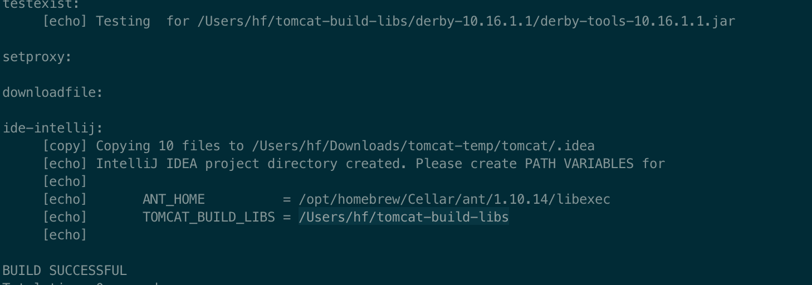
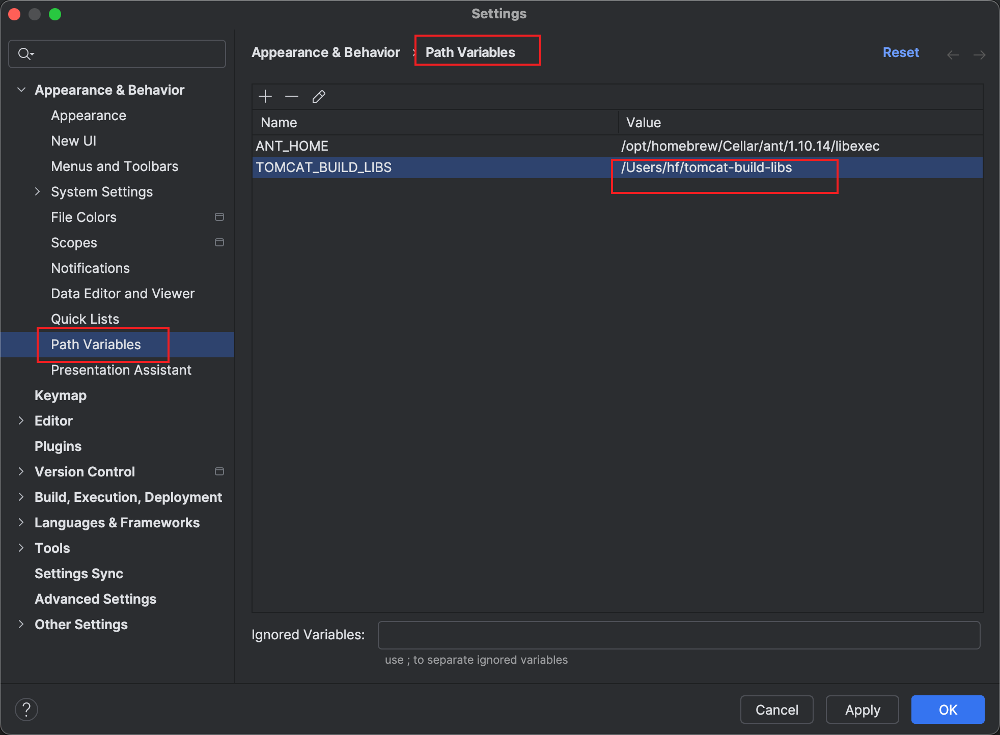
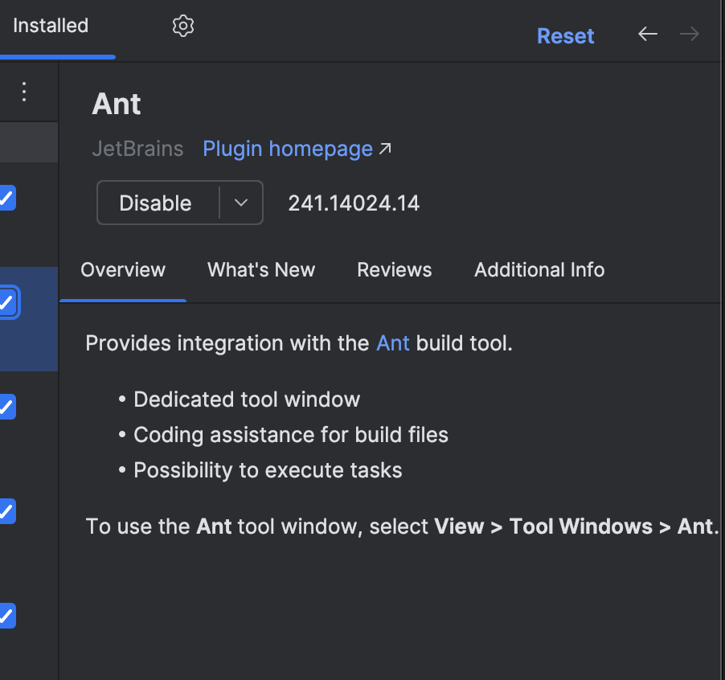
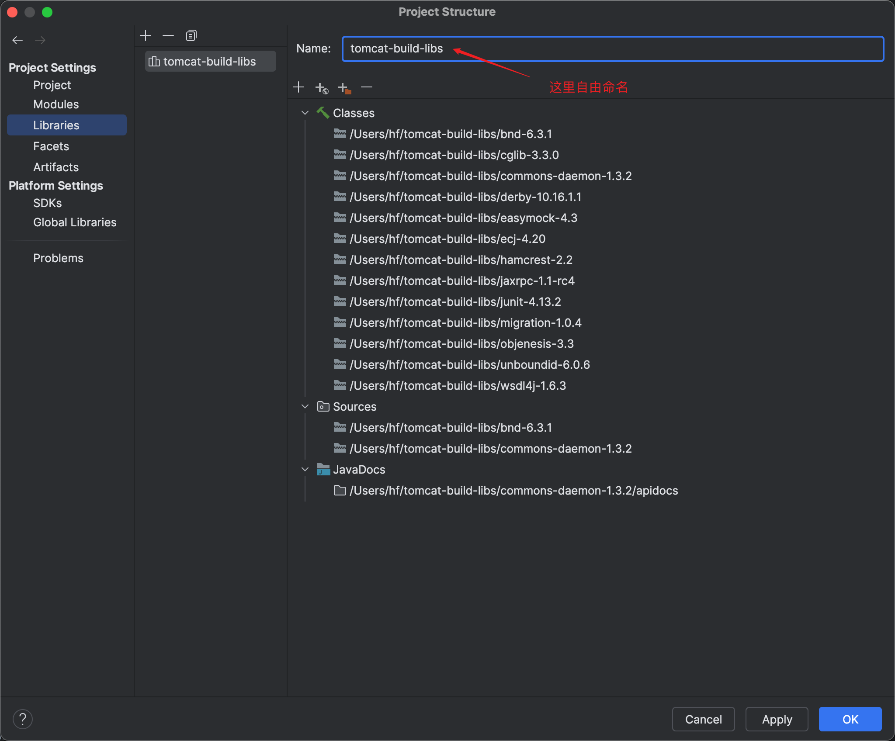
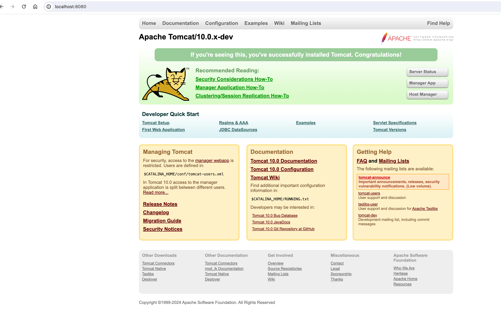

+++
date = '2024-03-05T11:36:36+08:00'
draft = false
title = '用IDEA本地编译启动tomcat源码'
toc = false
image = "images/IMG_0283.JPG"
categories = [
    "tomcat",
]

+++


1. github 上克隆源代码并切换到指定版本分支

   ```bash
   git clone https://github.com/apache/tomcat.git
   cd tomcat && git checkout 10.0.x
   ```

2. 安装ant

   ```bash
   brew install ant
   ```

3. 执行`ant ide-intellij` 构造IDEA project. 这一步主要是会生成一个`.idea` 目录, 以及下载一些依赖到`${user.home}/tomcat-build-libs`目录。

   ```bash
   ant ide-intellij
   ```

   

   命令结束后结尾处可看到让配置PATH VARIABLES。

4. IDEA 配置PATH VARIABLES

   

5. IDEA 安装ant 插件



6. IDEA 打开tomcat 目录

7. IDEA配置Project Structure,  将`${user.home}/tomcat-build-libs`添加到Libraries下面

   

8. 运行ant, 编译

```bash
ant
```

运行完后会产生一个`output`目录

```html
output/
├── build
├── classes
├── i18n
├── jdbc-pool
└── manifests
```

9. Run configurations 以及设置VM options.

   找到`org.apache.catalina.startup.Bootstrap`, 运行其main方法，在run configurations 中添加VM options：

   ```html
   -Dcatalina.home=/Users/hf/Downloads/tomcat-temp/tomcat/output/build
   -Dcatalina.base=/Users/hf/Downloads/tomcat-temp/tomcat/output/build
   ```

   其中目录地址就是第8#中output 下面build 文件夹地址。

10. 运行org.apache.catalina.startup.Bootstrap main方法，及浏览器访问测试。

    

看到这个页面说明启动成功。
